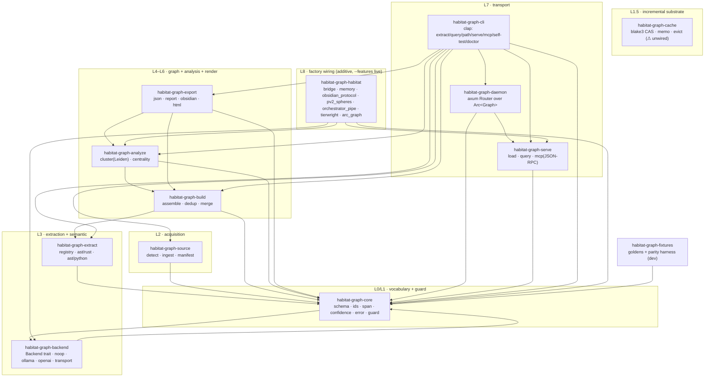
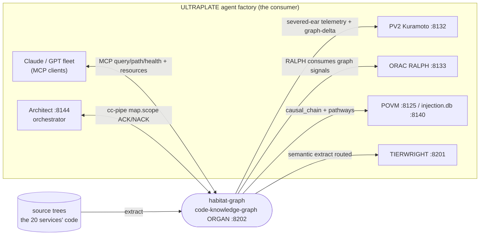
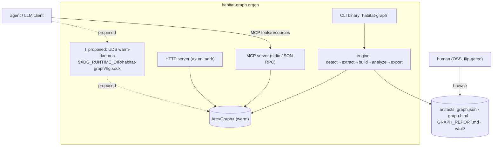
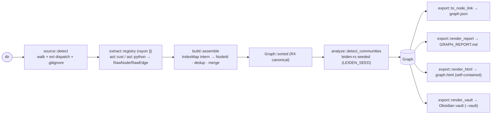
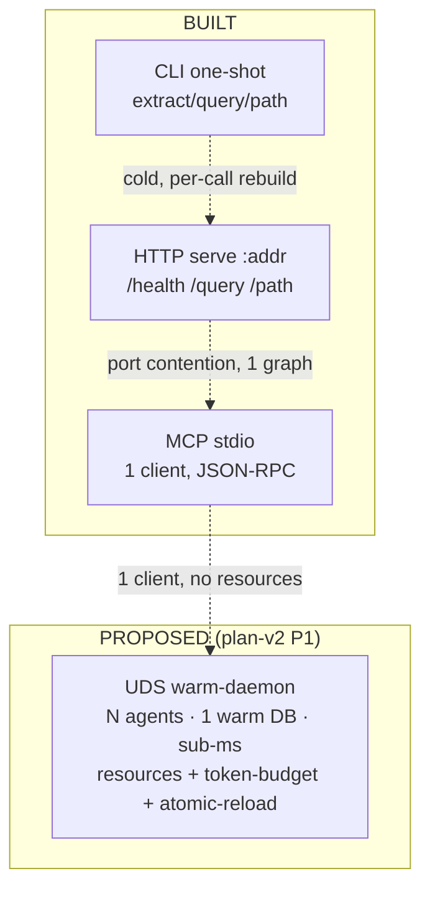
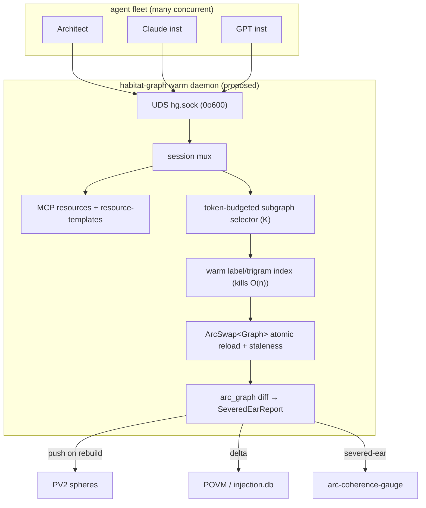

> Back to: [[CLAUDE.md]] · [[habitat-graph/README]] · [[EVIDENCE]] · plan: [[10_PLAN_V2_AGENT_FIRST_S1008796]] · API: [[12_LLM_FRIENDLY_API_AND_UDS_S1008796]] · **v3 target arch:** [[16_ARCHITECTURE_SCHEMATICS_V3_S1008901]] · **live plan:** [[14_PLAN_V3_UNIFIED_PARITY_AGENTIC_S1008901]]

# habitat-graph — Architecture Schematics & Mappings (S1008796)

Visual + tabular maps of the built system and the proposed agent-first surfaces. Open in Obsidian /
GitHub to render the Mermaid. Design only — no code lands until "start coding".

## 1. Crate dependency DAG (L0→L8, inward + acyclic)


*Rule: `core` depends on nothing; feature crates depend inward; `habitat` (L8) is additive — every
other crate compiles + runs without it. ⚠ `cache` is currently orphaned (no crate depends on it) — the
plan-v2 P1 wires it for real incremental `--update`.*

## 2. C4 — Context (the organ in the factory)



## 3. C4 — Container (transports + artifacts)



## 4. End-to-end extract dataflow



## 5. Sequence — an agent calls the MCP organ

```mermaid
sequenceDiagram
  participant A as Agent (Claude/GPT)
  participant M as serve::mcp (stdio)
  participant G as Arc&lt;Graph&gt;
  A->>M: {jsonrpc,id,method:"initialize"}
  M-->>A: {result:{protocolVersion,serverInfo,capabilities}}
  A->>M: {method:"notifications/initialized"}
  Note over M: notification → no reply
  A->>M: {id,method:"tools/list"}
  M-->>A: {result:{tools:[graph_query,graph_path,graph_health]}}
  A->>M: {id,method:"tools/call",params:{name:"graph_query",arguments:{query:"Confidence"}}}
  M->>G: find_by_label("Confidence")  (⚠ O(n) today)
  G-->>M: matches
  M-->>A: {result:{content:[{type:text,text:"4 node(s)…"}],isError:false}}
```

## 6. Transport map — CLI vs HTTP vs MCP-stdio vs proposed UDS



| Transport | Concurrency | Warmth | Latency | Best for |
|---|---|---|---|---|
| CLI one-shot | 1 | cold (rebuild each call) | high | scripts, hooks, CI |
| HTTP serve | many | warm (one graph) | ms + port | dashboards, cross-host |
| MCP stdio | 1 per process | warm | low | a single Claude Code client |
| **UDS warm-daemon (proposed)** | **many agents** | **warm, shared, salsa** | **sub-ms** | **the factory fleet** — see `12_…` |

## 7. Proposed agent-first architecture (plan-v2 P0–P2)



## 8. Crate → responsibility → public API (mapping)

| Crate | Layer | Responsibility | Public surface (key) |
|---|---|---|---|
| core | L0/L1 | vocabulary + security guard | `Graph/Node/Edge/Community/Confidence/Span/NodeId`, `GraphError/Result`, `display_safe/sanitize_label/confine_to/validate_url/screen_for_secrets` |
| cache | L1.5 | blake3 CAS · memo · evict (⚠ unwired) | `CacheKey`, `MemStore`, `memoize`, `partition` |
| source | L2 | detect · ingest · manifest | `detect(dir,&exts)`, `ingest`, `manifest` |
| extract | L3 | tree-sitter extraction | `registered_extractors()`, `extract_files(&files)` |
| backend | L3 | semantic LLM backends | `Backend` trait, `NoopBackend/OllamaBackend/OpenAiCompatBackend`, `HttpTransport/StaticTransport`, `parse_semantic/build_prompt` |
| build | L4 | assemble · dedup · merge | `assemble(Vec<Extraction>) -> Graph`, `dedup`, `merge` |
| analyze | L5 | Leiden + centrality | `detect_communities(&Graph)`, `degree_centrality(&Graph)` |
| export | L6 | json · report · obsidian · html | `to_node_link`, `render_report`, `render_vault`, `render_html` |
| daemon | L7 | axum HTTP host | `build_router(Arc<Graph>)`, `run_server(Arc<Graph>, addr)` |
| serve | L7 | load · query · **mcp** | `from_node_link`, `find_by_label`, `shortest_path`, `handle_jsonrpc(&Graph,&str)` |
| cli | L7 | clap product binary | commands: extract/query/path/serve/mcp/self-test/doctor |
| habitat | L8 | factory wiring (`--features live`) | `bridge/memory/obsidian_protocol/pv2_spheres/orchestrator_pipe/tierwright/arc_graph` |
| fixtures | dev | parity harness | `NormalizedGraph`, `from_golden/from_core`, `classify → ParityReport` |

---
*Architecture schematics S1008796 · Claude @ cortex. Detailed API + UDS contracts → `12_…`; diagnostics → `13_…`.*
