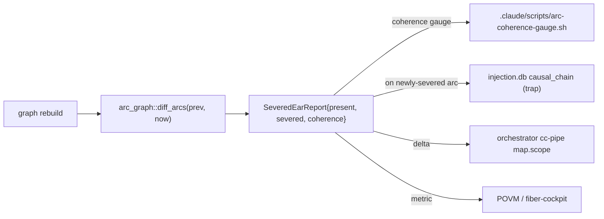

> Back to: [[CLAUDE.md]] · [[habitat-graph/README]] · [[EVIDENCE]] · plan: [[10_PLAN_V2_AGENT_FIRST_S1008796]] · API: [[12_LLM_FRIENDLY_API_AND_UDS_S1008796]] · **v3 diagnostics:** [[18_DIAGNOSTICS_OBSERVABILITY_V3_S1008901]] · **live plan:** [[14_PLAN_V3_UNIFIED_PARITY_AGENTIC_S1008901]]

# habitat-graph — Diagnostics & Observability Design (S1008796)

What the organ must *tell* its two readers — an **operator** (is it healthy, fresh, deployed?) and an
**agent** (what can I trust, what am I not seeing, is this stale?). Design only — no code until
"start coding". Built surfaces: `cli::meta::doctor`, `daemon::handlers::health_json`, `serve::mcp`.

## 1. Self-describe surfaces (machine-first)

| Surface | Today | Add |
|---|---|---|
| `doctor` | prose: `engine: source+extract+build+analyze+export (backend: ast-only)` | `doctor --json` → the **capability manifest** (`12_…` §B2): name/version/schema_version, tools, resources, transports, languages, feature flags, graph counts+generation+stale, completeness |
| `GET /health` | `{nodes,edges,communities,version}` | `+ generation` (content hash), `+ stale` (bool), `+ source_mtime`, `+ uptime`, `+ schema_version` |
| `graph_health` (MCP) | counts text | structured envelope incl. generation + completeness + staleness |
| (new) `doctor --schemas` / `habitat-graph://schema` | — | the JSON Schemas (`12_…` §F) so a model self-teaches the format |

**Freshness/staleness is the key agent diagnostic:** an agent must know if the served graph lags the
source. Expose `generation` (content hash of the graph) + `source_mtime` + `stale:bool` on every
health/query response — the witness-filter-then-cap discipline (a stale graph is *served with a flag*,
never silently). Ties to the daemon atomic-reload (plan-v2 AGT-7).

## 2. Completeness envelope + confidence as first-class diagnostics

The organ's honest self-report of *what it does not contain* — surfaced, not buried in a doc:
```json
"completeness": {
  "node_coverage_pct": 97, "structural_pct": 96,
  "edge_classes_emitted": ["calls","method","contains","inherits","imports_from"],
  "edge_classes_omitted": ["uses"],            // the deliberate 0/156 divergence (EVIDENCE D2)
  "confidence": {"extracted": N, "inferred": N, "ambiguous": N},
  "languages_covered": ["rust","python"], "per_language": {"rust": {...}, "python": {...}} }
```
This makes the parity envelope (`EVIDENCE.md:44`) a runtime contract: an agent reading it knows not to
infer a `uses` relation's absence as "no usage." Per-language coverage is mandatory as P3 adds
grammars — a model must not make a TS wiring decision on a partially-supported grammar.

## 3. arc-graph severed-ear — continuous factory-wiring TELEMETRY (the killer diagnostic)

D6 built `arc_graph::{extract_arcs, diff_arcs → SeveredEarReport{present, severed, coherence}}`
(`arc_graph.rs:70-162`) — deterministic, partial-graph-safe — but runs **one-shot**. Promote it to the
organ's headline diagnostic (plan-v2 AGT-4 / P2):


- **Emits:** `coherence` (present/(present+severed)), the list of `severed` arcs (producer→consumer
  bridges that broke), and a delta vs the prior rebuild.
- **To:** the `arc-coherence-gauge` data sink (its declared consumer, `02_HABITAT_INTEGRATION.md:70`),
  an injection.db `causal_chain` row on a *newly*-severed arc (a real regression), and the orchestrator
  pipe. **Live writes are arming-gated** (`factory.authorize.habitat-graph`); read-only telemetry is not.
- **Threshold:** a coherence drop > δ or any newly-severed *declared* arc = a factory-wiring alarm. This
  auto-detects the severed bidi-wiring arcs the S1008620 work hand-builds today.

## 4. Structured logging + tracing + per-stage metrics

- **`tracing` crate** (habitat convention) with spans per pipeline stage; a `--json-logs` mode for
  machine ingestion. Never `println!` diagnostics on stdout (stdout is the data contract — `cli`).
- **Per-stage extract metrics** (emit on `extract`, queryable via `doctor --json`):
  `{files_detected, files_extracted, parse_errors, nodes, edges, communities, stage_durations_ms:{detect,extract,build,analyze,export}}`.
  Parse-error count is a silent-quality signal today (a grammar that half-fails still "succeeds").
- **Parity-regression as a standing diagnostic**, not just a CI gate: surface the last parity run
  (`node_pct/structural_pct` per golden) in `doctor --json` so drift is observable, not only on a gate.
- **Health convention:** `/health` 200 + sane counts for `cc-health` (path-map aware); the organ
  registers like the rest of the fleet. The daemon's `generation`+`stale` make liveness ≠ freshness
  explicit (the N-2 liveness≠presence lesson, MEMORY.md).

## 5. Operator vs agent — a Diátaxis split of what each needs

| Reader | Needs | Surface |
|---|---|---|
| **Operator** (human) | is it deployed/healthy/fresh? rollback? | `doctor` (prose), `/health`, `cc-health`, `runbooks/{DEPLOY,INCIDENT}`, parity-regression status |
| **Agent** (LLM) | what can I trust, what's missing, is it stale, how do I call it? | `doctor --json` manifest, completeness envelope, typed errors, `generation`, `habitat-graph://schema` |
| **Cognitive loops** (PV2/ORAC/POVM) | did the architecture change? is an arc severed? | arc-graph telemetry (§3), graph-delta push (AGT-5), severed-ear → injection.db |

## 6. Diagnostics backlog (mapped to plan-v2 phases)

| Diagnostic | Phase | Effort |
|---|---|---|
| `doctor --json` capability manifest + freshness | P0 | SMALL |
| `/health` + `graph_health` generation/stale fields | P0 | SMALL |
| Completeness envelope on every response | P1 / AGT-6 | MED |
| Typed `kind` errors at the agent boundary | P0-P1 | SMALL-MED |
| `tracing` spans + `--json-logs` + per-stage metrics | P1 | MED |
| arc-graph continuous severed-ear telemetry | P2 / AGT-4 | MED (live writes arming-gated) |
| Parity-regression surfaced in `doctor --json` | P1 | SMALL |
| Per-language completeness (as grammars land) | P3 | tracks P3 |

---
*Diagnostics & observability design S1008796 · Claude @ cortex. Built surfaces: `cli::meta`, `daemon::handlers`,
`habitat::arc_graph`. Proposals are plan-v2 (`10_…`). No code until "start coding".*
