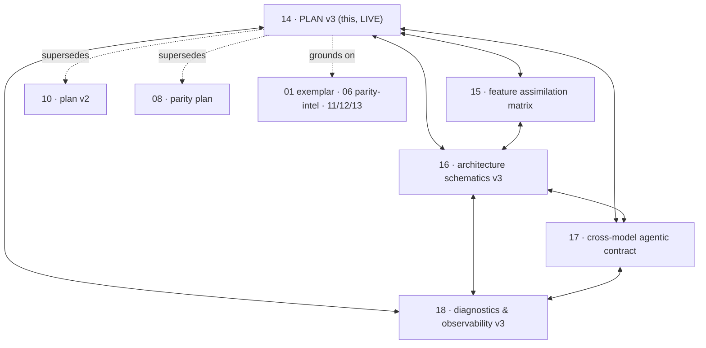

> Back to: [[CLAUDE.md]] · [[habitat-graph/README]] · [[EVIDENCE]] · **V3 corpus:** [[15_FEATURE_ASSIMILATION_MATRIX_S1008901]] · [[16_ARCHITECTURE_SCHEMATICS_V3_S1008901]] · [[17_CROSS_MODEL_AGENTIC_CONTRACT_S1008901]] · [[18_DIAGNOSTICS_OBSERVABILITY_V3_S1008901]] · [[19_PLAN_SCHEMATIC_MAP_S1008901]]
> **Supersedes:** [[10_PLAN_V2_AGENT_FIRST_S1008796]] · [[08_GRAPHIFY_PARITY_PLAN_S1008796]] · **assimilates:** [[09_PARITY_PLAN_GAP_ANALYSIS_S1008796]] · **grounds on:** [[01_GRAPHIFY_EXEMPLAR_MAP]] · [[06_PARITY_INTEL]] · [[11_ARCHITECTURE_SCHEMATICS_S1008796]] · [[12_LLM_FRIENDLY_API_AND_UDS_S1008796]] · [[13_DIAGNOSTICS_AND_OBSERVABILITY_S1008796]]
> **Resume (bidirectional):** new context window → type **"start coding"** — the workspace `CLAUDE.local.md` operating anchor (§ START CODING — habitat-graph V3) resumes here. First move = G-ABI (`abi-matrix-s1008901.md`).

# habitat-graph — Plan v3: Unified Full-Parity + Agentic Roadmap (S1008901)

> **THIS DOCUMENT IS THE LIVE PLAN.** It supersedes both doc 08 (parity, Frame-A) *and* doc 10 (agent-first, Frame-B).
> Doc 10 trimmed parity to the factory-actual languages and put agent-first first. **Luke's S1008901
> direction reverses both trims:** deliver **FULL graphify parity (every feature)** *and* the
> **agent-first / multi-model optimization** — as one superset, **parity first → agentic after.**
> Nothing in 08/10 is lost; everything is re-sequenced and the trims are lifted (see §13 disposition).

---

## 0. The frame this plan names (what changed at S1008901)

Three operator decisions (S1008901) re-shape the roadmap. Each is recorded here so the plan is falsifiable against intent:

| # | Decision (Luke @ 0.A, S1008901) | Effect on this plan |
|---|---|---|
| D-A | **Full parity + assimilate ALL graphify features** (reverses doc 10's trim of 7 grammars + 4 exporters + explain/vision) | Every doc-08 §A row is back IN scope; the OSS-parity backlog (doc 10 §7) is promoted into the live roadmap (Phases PA–PE). |
| D-B | **Parity first → agentic after** (reverses doc 10's "agent-first P0 first") | Roadmap order is PA→PE (full parity) **then** A0→A4 (agentic/multi-model). A *minimal trust seam* rides inside parity (§3.0) — the one mitigation, flagged. |
| D-C | **Plan both DoDs; public-flip stays a named Luke decision** | §1 keeps the dual DoD; the OSS-public flip is in the §7 ledger, **not pre-decided**. Factory-Organ DoD is live until flipped. |

**Cross-cutting requirement (D-D):** every served surface is **optimized for agentic LLM use — Claude Code 4.8+ and GPT-5.5+ (model-agnostic)**. That contract is its own doc ([[17_CROSS_MODEL_AGENTIC_CONTRACT_S1008901]]) and is woven into the DoD (§8 FO/OSS rows + XM-* rows).

**Where we start (verified ground truth, [VBE] `EVIDENCE.md`):** 13-crate workspace, **1225 all-targets tests / 0 failed**, pedantic-clean, `forbid(unsafe)`, D0→D7 sealed, pushed to both remotes at HEAD, port `:8202` claimed, MCP organ live-proven over stdio, **97% node / 96% structural parity** vs the httpx golden. This is a *completion + breadth + optimization* plan, not a build-from-zero.

---

## 1. Dual Definition of Done (public-flip gated, D-C)

Two DoDs. **Which is live is gated on the OSS-public flip (Luke @ 0.A, one-way door, `EVIDENCE.md:85`).** Until the flip, **§1A is the live DoD**; §1B is built to completion regardless (D-A) but only *governs acceptance* after the flip.

### 1A · Factory-Organ DoD — THE LIVE DEFAULT (private organ)
Done when the organ serves the agent substrate cheaply, coherently, with a trust signal, **and reaches full graphify feature coverage** (D-A folds the parity rows in):

| # | Criterion | Verifiable by |
|---|---|---|
| FO-1 | MCP exposes **resources + templates** alongside tools (`habitat-graph://node/{label}`, `://community/{id}`, `://report`, `://schema`) | `resources/list`+`read` round-trip ([[12_LLM_FRIENDLY_API_AND_UDS_S1008796]] §B1) |
| FO-2 | **Token-budgeted serve** `graph_query(scope, max_tokens=K)` packs ≤K, relevance-ordered, seed never dropped | budget test; deterministic packing (R4) |
| FO-3 | **Warm retrieval** — no O(n) substring scan; indexed label lookup | latency flat as graph grows (`serve/src/query.rs:14-23`) |
| FO-4 | **Stable node identity** survives `--update`/rename (content-addressed IDs) | rename-stability gate |
| FO-5 | **Completeness/confidence envelope** on every response; `confidence` filter | envelope present; `EXTRACTED`-only filter test |
| FO-6 | **Daemon atomic reload + fail-soft** (`arc-swap` + staleness header) | reload + concurrent-rebuild soak |
| FO-7 | **arc-graph severed-ear** served as continuous telemetry → gauge + orchestrator + injection.db | rebuild-that-severs emits delta |
| FO-8 | **All factory + OSS languages** extracted at warranted parity (D-A: TS/JS/Go **and** java/c/cpp/ruby/c#/kotlin/scala/php) each with pinned-oracle golden + per-grammar envelope | per-grammar parity gate (§6 ABI gate first) |
| FO-9 | **Every graphify exporter** present (svg/graphml/cypher/wiki) + analytics (god-nodes/surprising/suggested-Q/token-benchmark) + lifecycle (update/watch/hooks/install/add/mode-deep) | per-feature gate vs golden (doc 15 matrix) |
| FO-10 | **Semantic/multimodal** path (semantic-extract/pdf/vision/explain) **TIERWRIGHT-routed**, local-first default | `is_local()` audit; mock-tested; DoS caps (§7) |
| FO-11 | **Multi-model driven** — Claude 4.8+ via MCP, GPT-5.5+ via MCP↔function-call bridge / HTTP / UDS | XM test matrix ([[17_CROSS_MODEL_AGENTIC_CONTRACT_S1008901]] §G) |
| FO-12 | Workspace gate-green, `forbid(unsafe)`, no `unwrap`/`expect` in lib, both remotes current | `/gate`; `git ls-remote`==`rev-parse HEAD` |

### 1B · OSS-Parity DoD — CONDITIONAL (gated on the public flip)
Applies **iff** Luke flips visibility public. Doc 08 §E, **corrected** (P1-G2, doc 09:30): "full parity" is the **achievable envelope `node≥80% + structural≥70%`**, *not* byte-parity (`calls`/`uses` = deliberate 0/156 divergence, `EVIDENCE.md:44`).

> Every doc-08 §A row ✅; `habitat-graph --help` covers graphify's command surface; the comparison
> table ([[Commands & graphify Comparison (S1008796)]]) shows no ❌; parity harness green across the
> multi-language golden corpus; both remotes current.

The two DoDs **converge under D-A**: §1A FO-8/FO-9/FO-10 already require every §1B row. The flip changes only *who the reader is* (human dev vs agent) and which extra human-facing exporters become obligations vs nice-to-haves.

---

## 2. Feature assimilation — summary (full matrix → doc 15)

Every graphify feature (set fetched live 2026-06-28) is mapped to a habitat-graph home, current status, target phase, and gate in **[[15_FEATURE_ASSIMILATION_MATRIX_S1008901]]**. Headline counts:

| Class | graphify features | hg status today | lands in |
|---|---|---|---|
| Core pipeline (extract/query/path/json/report/obsidian/html/Leiden/cache/confidence) | 10 | ✅ at parity | DONE |
| Grammars | 11 (ts js go java c cpp rb cs kt scala php) + docs | ❌ (rs+py only) | **PA** |
| Exporters | svg · graphml · cypher · wiki | ❌ | **PB** |
| Lifecycle | update · watch · hook · install · add · mode-deep | 🟡/❌ | **PC** |
| Analytics | god-nodes · surprising · suggested-Q · token-benchmark | 🟡/❌ | **PD** |
| Semantic/MM | semantic-extract · pdf · vision · explain | 🟡/❌ | **PE** |
| Agentic (no graphify equivalent) | AGT-1…7 + cross-model (XM-1…) | ❌ (designed 12/13) | **A0–A3** |

---

## 3. The unified roadmap — PARITY FIRST → AGENTIC AFTER (D-B)

```mermaid
flowchart LR
  subgraph PARITY["PHASE BLOCK 1 — FULL graphify parity (D-A)"]
    PA["PA · 11 grammars + doc nodes\n(+ABI gate §6, +per-grammar envelope seam §3.0)"]
    PB["PB · exporters\nsvg · graphml · cypher · wiki"]
    PC["PC · lifecycle\nupdate · watch · hook · install · add · mode-deep"]
    PD["PD · analytics\ngod-nodes · surprising · suggested-Q · token-benchmark"]
    PE["PE · semantic / multimodal\nsemantic · pdf · vision · explain (TIERWRIGHT)"]
  end
  subgraph AGENTIC["PHASE BLOCK 2 — agentic + multi-model optimization (D-B,D-D)"]
    A0["A0 · agent front door\nMCP resources · doctor --json · token-budget · typed errors · install"]
    A1["A1 · warm + identity-stable + trust\nwarm index · stable IDs · generation · UDS daemon"]
    A2["A2 · substrate payoff\narc-graph telemetry · delta-push · watch→delta (S1008620)"]
    A3["A3 · cross-model hardening\nClaude 4.8+ / GPT-5.5+ XM matrix · MCP↔fn bridge"]
  end
  A4["A4 (OPTIONAL, flip-gated) · OSS public flip + crates.io"]
  PA-->PB-->PC-->PD-->PE-->A0-->A1-->A2-->A3-.->A4
```

### 3.0 The trust seam inside parity (the one D-B mitigation — flagged for veto)
Per-grammar parity is unsafe without a *completeness signal* (doc 13 §2; an agent must never make a TS wiring decision on a 60%-supported grammar). So **two SMALL agentic diagnostics ride inside the parity block** as safety prerequisites, not as the agentic optimization:
- **per-grammar completeness envelope** is emitted by each PA grammar (built with the grammar, not after).
- **`doctor --json` capability manifest** ([[12_LLM_FRIENDLY_API_AND_UDS_S1008796]] §B2) lands at the *start* of PA so every subsequent parity feature is machine-discoverable.

Everything else agentic (resources, token-budget, UDS, warm index, arc-telemetry, cross-model matrix) stays in Block 2, after parity. *If you want zero agentic content inside parity, veto §3.0 and the envelope becomes a stub-count only.*

### 3.1 PA — Language breadth (the biggest visible gap) ★
- **Scope (D-A, full):** all 11 grammars `ts js go java c cpp rb cs kt scala php` + doc nodes (`.md/.txt/.rst`). Existing: rust+python (`EVIDENCE.md:43-44`).
- **Shape:** one `extract::ast::<lang>` impl + its `tree-sitter-<lang>` crate + a per-grammar pinned-oracle golden, behind the existing extension-dispatch registry (`extract/src/registry.rs:40-58`).
- **Gate:** **§6 ABI matrix resolved first** (hard blocker); then per-grammar node≥80% + structural≥70% vs the committed golden; `forbid(unsafe)` holds (tree-sitter safe API); per-grammar completeness envelope present (§3.0).
- **Method:** dynamic Workflow — one `forge-rust-coder-v4` fiber per language (collision-free, distinct files) + `forge-tester` parity judge **outside** the loop (the regime that built D2–D6).
- **Hidden cost made explicit (C-1, doc 09:27):** each grammar = extractor + ≥50 tests + **corpus sourcing + graphify-oracle run + version-pinned golden commit**. The golden pipeline is the larger half. Budgeted in §4.

### 3.2 PB — Exporters (full set)
- `export::svg` (laid-out graph → SVG, `quick-xml`/string-gen) · `export::graphml` (Gephi/yEd, `quick-xml`) · `export::cypher` (`CREATE`/`MERGE` string-gen, neo4j) · `export::wiki` (per-node article + `index.md`, folds with the existing obsidian exporter `export/src/obsidian.rs`).
- CLI flags `--svg --graphml --neo4j --wiki` wired into `extract` (`cli`).
- **Gate:** each vs a golden; svg/graphml validate as XML; cypher parses; wiki `index.md` links resolve. **Split rebuild (F13):** human-artifact exporters (svg/graphml/wiki) must never gate the agent-critical path (graph.json + index) — see [[16_ARCHITECTURE_SCHEMATICS_V3_S1008901]] §5.

### 3.3 PC — Lifecycle & integration
- `--update` (wire the **orphaned** `cache::partition` + `build::merge`, `cache/src/partition.rs:13-28`) — **with the real-incrementality correction (C-4, doc 09:38):** file-cache is extraction-level only; Leiden re-runs globally (`analyze/src/cluster.rs`). Either bound re-clustering to touched communities or **measure + document the analyze cost honestly — stop calling file-cache "incremental."**
- `--watch` (`notify`, debounce) · `hook install` (`git2` post-commit + the deterministic `graph.json` merge driver, R4) · `install` (write Claude Code MCP config, **with snapshot→write→read-back safety**, P1-G8) · `add <URL>` (`source::ingest` + **SSRF/private-IP block**, C-2) · `--mode deep` (heuristic `uses`/`references` at INFERRED/AMBIGUOUS).
- **`--mode deep` gated OUT of analyze (T1/F12, doc 09:104):** INFERRED/AMBIGUOUS edges inflate degree, merge Leiden communities, and corrupt the community→PV2-sphere topology — they must be filtered on `Confidence` *before* `analyze::detect_communities`, exposed only on explicit human export.
- **watch×hook single-writer lock (P1-G10):** a commit fires the hook *and* `notify` → concurrent rebuilds race on the `graph.json` write. Add a lock.
- **schema-versioning (P1-G12):** add `schema_version` to the node-link envelope; `--update` against an older taxonomy must detect mismatch, not silently merge.

### 3.4 PD — Analytics
- god-nodes (surface `analyze::degree_centrality`, already computed) · surprising-connections (`analyze::patterns`, cross-community high-weight ranking) · suggested-questions (`analyze::questions`, heuristic from hubs/bridges; LLM-aug optional) · token-benchmark (`export::benchmark`, `tiktoken-rs`).
- **Dual-aim (the doc-09 transform):** keep the computation, but in Block 2 these *also* feed arc-graph (god-nodes/surprising → severed-ear/bridge analysis, F8) — built once in PD, re-sinked in A2.

### 3.5 PE — Semantic / multimodal (LLM path, local-first, TIERWRIGHT-routed)
- `extract::semantic` → the existing `Backend` (Noop default = **no behavior change** unless configured) · `.pdf` (feature `pdf`, `pdf-extract`/`lopdf`) · images (feature `vision`, **routed via TIERWRIGHT `:8201`** — never a raw external call on source, habitat rule) · `explain "<concept>"` (subgraph context → Backend summary).
- **Gate:** semantic off by default; `is_local()` audit; mock-tested without network; **DoS caps** on pdf/url/vision (size + timeout + memory bound, C-2). `--feature live` split (§7.6) before any live actuation.

### 3.6 A0 — Agent front door
MCP resources + templates (AGT-1) · token-budgeted serve (AGT-2) · typed `kind` errors (B4) · `doctor --schemas` + `habitat-graph://schema` resource · `install` already in PC, here it gains MCP-resource registration. All per [[12_LLM_FRIENDLY_API_AND_UDS_S1008796]] §B/C.

### 3.7 A1 — Warm, identity-stable, trust-bearing
Warm trigram/inverted label index (AGT-3, kills O(n)) · content-addressed stable node IDs (AGT-5) · `generation` content-hash on every response (B5, agent-side cache key) · **UDS warm-daemon** (AGT-7, [[12_LLM_FRIENDLY_API_AND_UDS_S1008796]] §D) reusing `handle_jsonrpc` verbatim · `arc-swap` atomic reload (AGT-7/C-3).

### 3.8 A2 — Substrate payoff (pays into S1008620)
arc-graph continuous severed-ear telemetry (AGT-4) · `--watch`→delta-push to PV2/POVM/arc-coherence (F7, **live writes arming-gated** `factory.authorize.habitat-graph`) · god-nodes/surprising re-sinked to arc-graph + `bridge-contract`/`schema-drift` skills (F8) · split rebuild pipeline (F13).

### 3.9 A3 — Cross-model hardening (Claude 4.8+ / GPT-5.5+)
Realize [[17_CROSS_MODEL_AGENTIC_CONTRACT_S1008901]]: MCP↔function-call bridge for GPT-5.5+, capability negotiation, the multi-model test matrix (XM-1…XM-7), prompt-shaped tool descriptions, determinism-cache contract. **This is where D-D (multi-model optimization) is *proven*, not just designed.**

### 3.10 A4 — OSS public flip + crates.io (OPTIONAL, flip-gated)
Only if Luke flips (§7.1). `gh repo edit --visibility public` · crates.io publish (token-gated, irreversible) · doc 08 §1B parity DoD becomes the acceptance gate.

---

## 4. Sizing & sequencing

| Phase | Scope | Effort | Method | Phase gate |
|---|---|---|---|---|
| **PA** | 11 grammars + doc nodes + ABI gate + envelope seam | **XL** | dynamic Workflow (1 fiber/lang) + parity judge outside loop | ABI resolved · per-grammar parity vs pinned golden · envelope present |
| **PB** | 4 exporters | **M** | direct / 1 fiber/exporter | each vs golden; XML valid; cypher parses; wiki links resolve |
| **PC** | 6 lifecycle features | **M-L** | direct (cache/merge exist) | update idempotent + analyze cost measured · watch×hook lock · install backup · SSRF block · schema_version |
| **PD** | 4 analytics | **M** | direct (heuristic) | deterministic outputs; benchmark token math tested |
| **PE** | semantic + pdf + vision + explain | **L (gated)** | direct, feature-gated, TIERWRIGHT-routed | off-by-default; is_local audit; DoS caps; mock-tested |
| **A0** | resources · token-budget · typed errors · schema | **S-M** | direct (handler exists) | resources round-trip; max_tokens≤K; typed kind errors |
| **A1** | warm index · stable IDs · generation · UDS | **M-L** | direct | flat latency; rename-stability; UDS reuses handle_jsonrpc |
| **A2** | arc-telemetry · delta-push · split rebuild | **M** | direct (arc_graph exists) | severed-ear delta reaches gauge; arming-gated writes |
| **A3** | cross-model matrix + bridge | **M** | direct + live model harness | XM-1…7 pass on Claude 4.8+ & GPT-5.5+ |
| **A4** | public flip + crates.io | **S (one-way)** | operator | flip + publish; §1B DoD green |

**Sizing truths doc 08 missed:** (1) PA effort is dominated by the **golden pipeline** (corpus sourcing + oracle run + pinned commit), not the extractors — see C-1. (2) The **ABI matrix (§6) is a hard prerequisite** to PA sizing, not a footnote. (3) The build method is proven (D0→D6 via Workflow + judges-outside-the-loop; the claim-verifier already caught a fiber over-claiming gate-green, `EVIDENCE.md:69`).

---

## 5. Build method (non-negotiable, carried from the proven regime)

- **Bottom-up, layer-batched**; no phase collapse — each module gets impl + gate + tests before the layer above.
- **Judges OUTSIDE the loop:** `forge-tester` (meaningfulness) + `forge-security-architect` (silent-swallow/fail-open/STRIDE) + `agent-claim-verifier` (re-run the gate, sha-check commits) — the regime that caught all defects in D2–D6.
- **Gate, every commit:** `check → clippy -D → pedantic → test` with `${PIPESTATUS[0]}` per stage; `forbid(unsafe)`; no `unwrap`/`expect` in lib; **≥50 meaningful tests on substantive modules at release-eligibility** (anti-test-fitting; thin I/O leaves get meaningful-at-level coverage — `EVIDENCE.md:45`).
- **Parity-gated:** only a *regression* fails (PARITY_RUNBOOK SEMANTIC-EQUIVALENT class).
- **EVIDENCE.md updated per phase, never ahead of the gate.** Both remotes current per commit (`git ls-remote`==`rev-parse HEAD`).
- **Standalone-only push** — never the superproject (`feedback_morph_ir_engine_standalone_only`).

---

## 6. The tree-sitter ABI matrix — PA's hard prerequisite (P1-G4, doc 09:35)

`tree-sitter-<lang>` crates routinely require **incompatible `tree-sitter` core ABI versions (13/14/15)**, and cargo permits **one** core version in the dependency tree. `cargo-deny` checks licenses/advisories — **not ABI** — so this is a separate, real gate that must close *before* PA is sized as committed.

**Gate G-ABI (blocks PA):** produce a compatibility matrix `(grammar crate × tree-sitter core ABI × last-compatible version)` for all 11 grammars; pick a single core ABI that satisfies the maximal set; for any grammar that cannot align, record the resolution (pin an older grammar release, vendor, or defer that one grammar to A4 with a logged reason — **no silent drop**). Output: `ai_docs/abi-matrix-s1008901.md` + a `deny.toml`/`Cargo.toml` pin set. Detailed schematic: [[16_ARCHITECTURE_SCHEMATICS_V3_S1008901]] §3.

**✅ RESOLVED (S1008901): [[abi-matrix-s1008901]] — PASS.** The premise was half-wrong in an instructive way: the grammars' `tree-sitter` core reqs are **`kind=dev`** (test-only, not built downstream); the real **`kind=normal`** dep is **`tree-sitter-language ^0.1`**, shared by ALL modern grammars — so they unify under any modern core. → standardize core **0.25.x (ABI 15)** + take every grammar at latest stable; **0 pins-older · 0 vendor · 0 defer** (Kotlin via the maintained `tree-sitter-kotlin-ng` fork, logged). One-time cost: bump core `0.22.6→0.25` + migrate the existing rust/python extractors from `language()` to the `LANGUAGE: LanguageFn` API + re-run their parity gates. **PA-1 unblocked.**

---

## 7. Decisions for Luke @ 0.A (the ledger — none auto-decided)

| # | Decision | Recommendation | Gates |
|---|---|---|---|
| 7.1 | **THE FORK — OSS public-flip** (which DoD is live, §1). One-way door (`EVIDENCE.md:85`). | *Stay private; §1A live.* Build §1B to completion (D-A) but govern by §1A until you choose. | A4; §1B acceptance |
| 7.2 | **Arm `factory.authorize.habitat-graph`** for A2 live actuation (PV2 sphere + POVM/injection.db delta-push). Currently **armed** (verified S1008901). | Keep armed for A2; until then arc-graph runs measure-only. | A2 live writes |
| 7.3 | **Multimodal/vision + embedding backend policy** (PE / AGT-3 optional). | **TIERWRIGHT `:8201`-routed** for all image/pdf/embedding semantic calls (habitat rule); defer the embedding stage until the trigram index proves insufficient. | PE; A1 optional |
| 7.4 | **New deps to vet** (`cargo-deny`/`cargo-audit`). PA: `tree-sitter-{ts,js,go,java,c,cpp,ruby,csharp,kotlin,scala,php}` (**resolve §6 ABI first**). PB: `quick-xml`. PC: `notify`, `git2`→libgit2. PD: `tiktoken-rs`. PE: `pdf-extract`/`lopdf` (RUSTSEC history), `reqwest`. A1: `arc-swap`. | Gate each on add; ABI matrix before any grammar crate. | PA–PE; A1 |
| 7.5 | **Restore the doc-01 §D deliberately-dropped?** (Bedrock/Gemini/Azure backends · Office docs · video · doc-translations · multi-platform install). D-A says "all features" — does that include these OSS-breadth extras? | *Keep dropped unless explicitly wanted; they are OSS-audience breadth, not graphify-core parity. Say the word and a PA/PB-style wave adds them.* | optional waves |
| 7.6 | **`--feature live` granularity** (reviewer risk). Today `live = {rusqlite, ureq, backend/net}` is one coarse flag. | Split into `live-memory` / `live-bridges` / `live-semantic` **before A2** so the delta-push surface is least-privilege. | A2 |
| 7.7 | **Disposition of human-only exporters under §1A** (svg/wiki have no factory consumer per doc 09). | Build them (D-A) but mark them human-artifact, split out of the agent-critical path (F13); they become obligations only post-flip (§1B). | PB; A2 |

---

## 7A. RATIFIED DECISIONS — the S1008901 grill (authoritative; amends §1/§3/§4/§6/§7)

24 decisions ratified by Luke @ 0.A in a 12-round adversarial grill (S1008901). Where these conflict
with an earlier section, **these win.** Through-line: *the factory's agent-critical read path is
sacred; all human/OSS breadth lives behind a seam that can never degrade it.*

| # | Ratified | Amends |
|---|---|---|
| R1a | **Stay private** — §1A is the live DoD; §1B built but latent; **A4 unscheduled** (revisit only on explicit go) | §1, §7.1 (closed) |
| R1b | **crates.io deferred indefinitely** — off the roadmap | §7 (closed) |
| R2a | **PA factory-actual-first** — PA splits: **PA-1** = TS/JS/Go + docs (prove registry+golden pipeline), **PA-2** = the 8 OSS grammars (java/c/cpp/ruby/c#/kotlin/scala/php) | §3.1, §4 |
| R2b | **ABI default = pin newest grammar release on the chosen core ABI**; vendor→defer only if none exists; deferral logged in the `abi` health field (no silent drop) | §6 |
| R3a | **graphify oracle pinned to ONE version forever** (2026-06-28 snapshot); re-pin only as a logged event | §3.1, §6 (C-1) |
| R3b | **Tiered parity bar:** Rust/TS/JS/Go → **node≥95% / structural≥90%**; OSS-tail → 80/70 baseline; drives the `maturity` field | §3.1, §4, FO-8 |
| R4a | **Keep the trust seam** — each grammar ships its completeness envelope + `maturity` as built; `doctor --json` lands at PA start | §3.0 (veto declined) |
| R4b | **`--mode deep` confidence-gated OUT of analyze/sphere/arc** — agent-critical graph stays EXTRACTED-only; deep edges human-export only | §3.3 (T1/F12) |
| R5a | **Semantic routing: TIERWRIGHT `:8201` in prod; local Ollama only behind a dev feature** (never the live path) | §3.5, §7.3 (closed) |
| R5b | **Vision deferred** to the LAST optional `vision`-gated wave (built only if a concrete consumer appears); PE ships **semantic-extract + pdf** | §3.5, FO-10 |
| R6a | **`--update` = measure + disclose:** wire file-cache (saves re-extraction) but surface `analyze.incremental:false` / `communities_reclustered:all`; build bounded re-clustering ONLY if measured Leiden cost proves a bottleneck | §3.3 (C-4) |
| R6b | **Wire the orphaned `cache` crate for extraction reuse**; measure the extract-vs-analyze split to aim the next optimization | §3.3, doc 16 §1 |
| R7a | **Token budget: heuristic estimator default + configurable per-model chars/token ratio + exposed `tokenizer` basis**; tiktoken-rs optional behind a feature | §3.6/A0, doc 17 §5 |
| R7b | **Dual node identity:** keep graphify's integer `id` (parity) **+** add `stable_id` = hash(kind‖qualified-path‖normalized-signature) that survives rename/update; agents/POVM/PV2 key on `stable_id` | §3.7/AGT-5, doc 16 §9 |
| R8a | **Build the UDS warm-daemon in A1** (reuses `handle_jsonrpc` verbatim) | §3.7/AGT-7 |
| R8b | **Split `--feature live` → `live-memory` / `live-bridges` / `live-semantic`** before A2 live actuation | §7.6 (closed) |
| R9a | **Grammars = feature-gated modules in `extract`** (per-grammar `--feature`), not separate crates; default build compiles only enabled langs | §3.1, doc 16 §1 |
| R9b | **Parity-diff + `forge-tester` meaningfulness audit is the grammar gate**; ≥50 binds substantive modules at release-eligibility, not thin leaves (anti-test-fitting) | §5 |
| R10a | **Dynamic Workflow (forge fibers + judges OUTSIDE the loop) for the PA/PB fan-outs**; main-loop for sequential/integrative work | §5 method |
| R10b | **Commit the V3 corpus now**, then one **gate-green commit per phase** (EVIDENCE updated, both remotes `ls-remote`==HEAD) | §5 |
| R11a | **doc-01 §D dropped features stay dropped**; the `Backend` trait remains the extension seam (add Gemini/Bedrock only on demand); install stays Claude-only | §7.5 (closed) |
| R11b | **PDF + `add <URL>` built behind hard DoS caps** (size/timeout/mem) + SSRF/private-IP block; marked human/operator, **off the agent-critical path** (split-rebuild F13) | §3.3/§3.5 (C-2) |
| R12a | **Analytics deterministic on the factory path** (R4-clean, cacheable by `generation`); any LLM-augmentation is a human-export extra, never on the agent/analyze path | §3.4 (P1-G11) |
| R12b | **DONE = §1A FO-1…12 + parity harness green (pinned goldens) + XM matrix green (Claude 4.8+/GPT-5.5+) + independent cross-family verification** (agent-claim-verifier + Zen/Pi audit) against the live tree, both remotes current | §8 |

**Net structural change:** the roadmap block PA becomes **PA-1 → PA-2**; the parity gate is **tiered**; A4 (public flip + crates.io) is **removed from the live sequence** (latent, explicit-go only); the §7 ledger is now **closed** except where a future consumer reopens 7.5/R5b.

## 7B. NON-ANTHROPOCENTRIC GAP PASS — the operate/inhabitant frame (S1008901)

Docs 14–19 are written in the **constructor frame** (how to BUILD the organ — phases, gates,
schematics, contracts). The frame not taken is the **operate/inhabitant frame** (what is the organ's
LIFE once it runs autonomously in the factory, over time, under multi-agent load). *Both passes are
the plan* (CLAUDE.local.md §3). The operate-frame artifact is the runbook
([[V3_LIVE_ORGAN_RUNBOOK_S1008901]]); the gaps it surfaces that feed back to the BUILD:

| NA | Frame-not-taken gap | Recommendation (build / ops landing) |
|---|---|---|
| NA-1 | freshness **signal** built (generation/stale) but no freshness **policy** | staleness policy: shelf-life + auto-rebuild cadence + served-stale contract — build: A1 generation-wait; ops: runbook §3 |
| NA-2 | plan assumes **one** graph; factory = 20 services / many repos | **NEW DECISION 7.8 — organ cardinality** (below). Default single-repo until decided. |
| NA-3 | read-optimized, but the agent's **own** perception-action loop is open (agent edits code → its map is stale w.r.t. its own action) | loop-closure contract: hook-triggered rebuild + a `generation` an agent can WAIT on — build: PC/A2; ops: runbook §4 |
| NA-4 | organ is **inert-per-build** while every other substrate (POVM/RALPH/PV2) LEARNS | **SPIKE not commitment** — graph-as-learning-substrate (query-frequency weighting, decay, RALPH co-evolution). Gate on the signal-density law: prove the static read path insufficient first. |
| NA-5 | build plan has **gates**; the live organ has **operations** (daemon lifecycle, soak, grammar hot-add, arming rituals, the organ's own incidents) — none exist for v3 surfaces | → **the runbook** ([[V3_LIVE_ORGAN_RUNBOOK_S1008901]]) |

**Decision 7.8 — Organ cardinality (NEW, NA-2, none auto-decided):** one organ per repo (self-hosting
default) · vs a **graph-of-graphs** with cross-repo edges · vs a per-service daemon **fleet**.
*Recommend: single-repo organ now (the self-hosting proof, `EVIDENCE.md:58`); revisit graph-of-graphs
when a concrete cross-repo agent need appears (e.g. an orchestrator decomposing a mission that spans
services).* Lands A1/A2 + runbook §12.

**Conventional residual gaps (Pass-1, build-frame refinements, non-blocking):** C-G1 golden-corpus
sourcing (PA-1 prep) · C-G2 XM live-model harness lane (A3) · C-G3 `stable_id` cross-language
signature normalization (A1) · C-G4 `schema_version` migration = rebuild-on-mismatch (PC) · C-G5
arc declared-set ownership (A2) · C-G6 DONE acceptance protocol (A3) · C-G7 daemon capacity target
(A1). Tracked here so they are not silently dropped.

## 8. Definition of Done — recap (dual, multi-model)

- **Live (private organ):** §1A FO-1…FO-12 — full graphify feature coverage (grammars + exporters + lifecycle + analytics + semantic/MM) **+** agent-resourced, token-budgeted, warm, identity-stable, trust-bearing, atomic-reload serving with arc-graph telemetry live **+** driven by Claude 4.8+ and GPT-5.5+ (XM matrix green), gate-green on both remotes.
- **Conditional (OSS public):** §1B — doc 08 §A rows ✅ at the achievable `node≥80% + structural≥70%` envelope, across the multi-language golden corpus — **after the public-flip one-way door (7.1).**
- **Every phase:** ships gate-green (`check→clippy→pedantic→test`, `${PIPESTATUS[0]}`), `forbid(unsafe)`, no `unwrap`/`expect` in lib, ≥50 meaningful tests on substantive modules, EVIDENCE.md updated (never ahead of the gate), both remotes current.

---

## 9. Corpus map (bidirectional)

Each V3 doc opens with a `> Back to:` header linking the whole corpus (the habitat bidi protocol). Doc 15 holds the per-feature row-level links; this doc holds the roadmap/decision spine.

---

## 10. Disposition of prior plans (nothing lost)

| Prior | v3 disposition |
|---|---|
| **doc 08** (parity, Frame-A) | **un-trimmed + promoted** — all §A rows are live (PA–PE). §E DoD → §1B (corrected envelope). |
| **doc 08 trim of 7 grammars / 4 exporters / explain / vision** | **REVERSED (D-A)** — all back in PA/PB/PE. |
| **doc 10** (agent-first, Frame-B) | **re-sequenced** — AGT-1…7 + cross-model move to Block 2 (A0–A3); the trust-seam subset rides inside parity (§3.0). doc 10 §1 dual-DoD kept (§1). |
| **doc 10 "agent-first first"** | **REVERSED (D-B)** — parity first; one flagged mitigation (§3.0). |
| **doc 09** (gap analysis) | **assimilated** — every C-1…C-4 / P1-G* / F* correction is bound to a phase gate (§3, §6, §7). |
| **docs 11/12/13** | **extended** by 16/18/17 respectively (V3 deltas), not replaced. |

---
*Plan v3 (unified full-parity + agentic) authored S1008901 (2026-06-28) · Claude @ cortex. Supersedes 08+10; assimilates 09; grounds on 01/06/11/12/13. Live actuation gated on `factory.authorize.habitat-graph` (armed) + the public-flip one-way door (Luke @ 0.A). Both passes are the plan (CLAUDE.local.md §3).*
