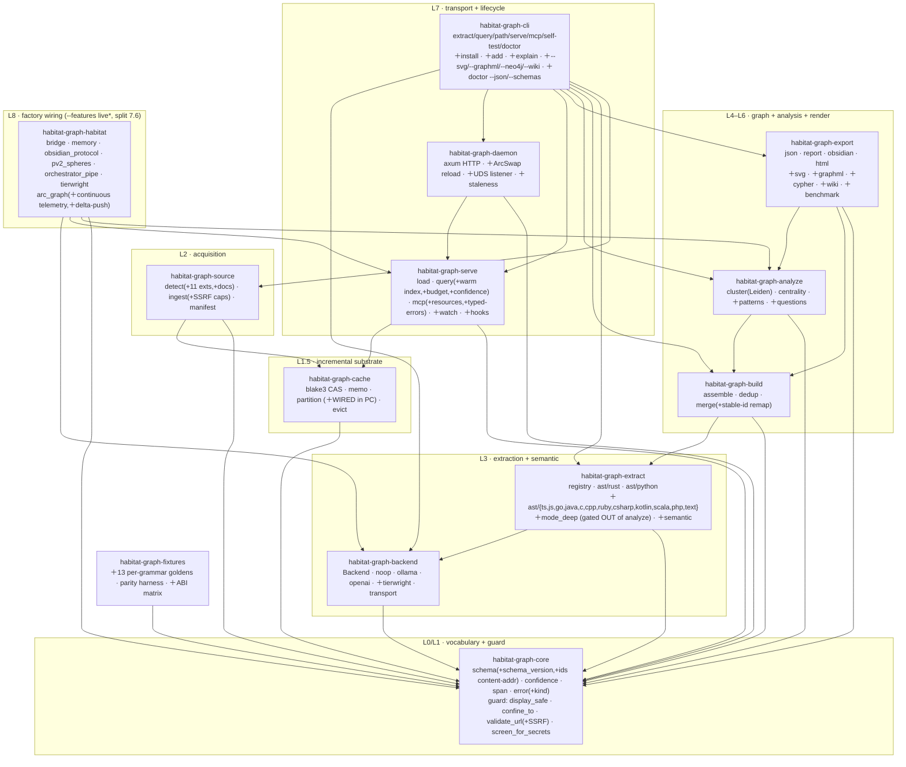
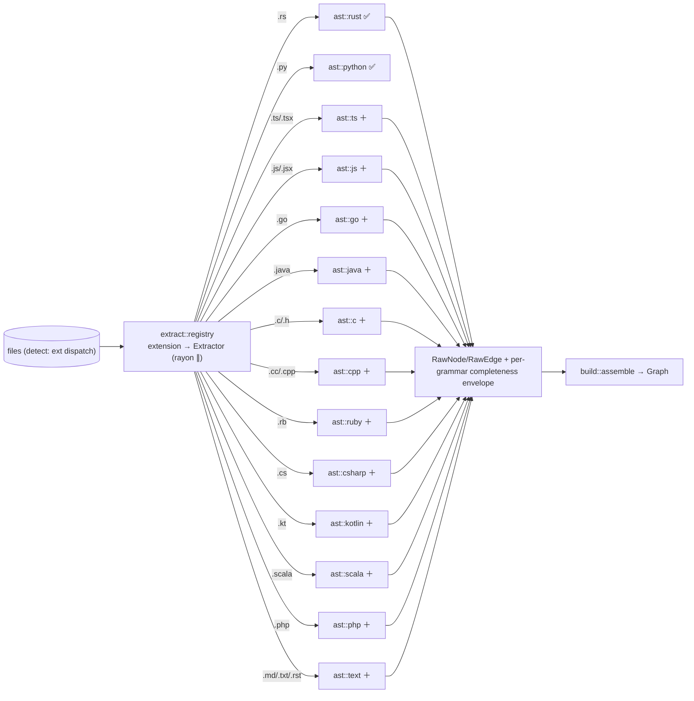
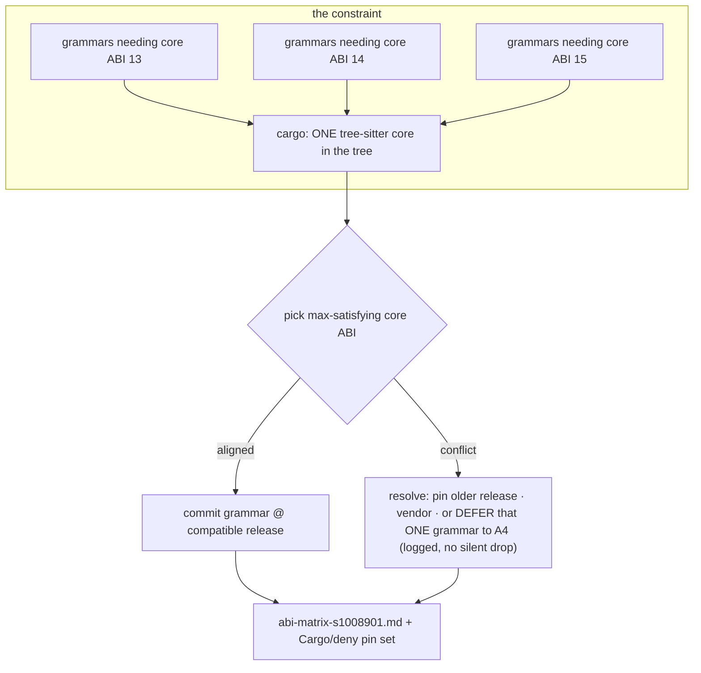
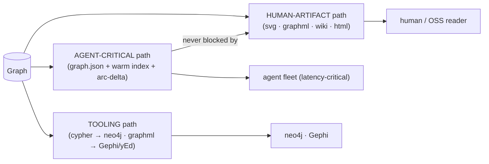
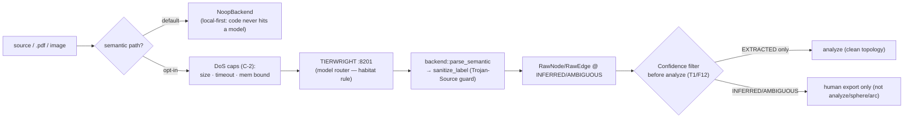
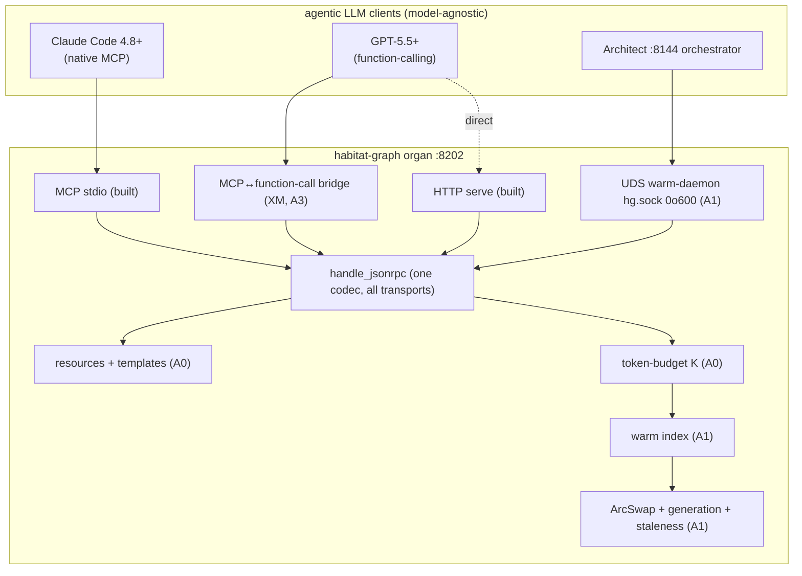
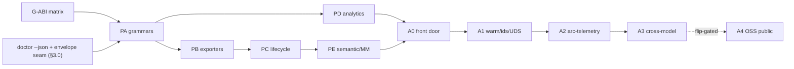

> Back to: [[CLAUDE.md]] · [[habitat-graph/README]] · [[EVIDENCE]] · **plan:** [[14_PLAN_V3_UNIFIED_PARITY_AGENTIC_S1008901]] · **V3 corpus:** [[15_FEATURE_ASSIMILATION_MATRIX_S1008901]] · [[17_CROSS_MODEL_AGENTIC_CONTRACT_S1008901]] · [[18_DIAGNOSTICS_OBSERVABILITY_V3_S1008901]] · [[19_PLAN_SCHEMATIC_MAP_S1008901]]
> **extends:** [[11_ARCHITECTURE_SCHEMATICS_S1008796]] (built-state DAG/C4/dataflow) — this doc adds the **target (full-parity + agentic) architecture**.

# habitat-graph — Architecture Schematics v3 (target state, S1008901)

Visual + tabular maps of the **full-parity + agentic target**. Open in Obsidian/GitHub to render
Mermaid. Design only — `forbid(unsafe)` and gate discipline hold for every box drawn here.
Built-state diagrams (current DAG, current dataflow, current sequence) live in [[11_ARCHITECTURE_SCHEMATICS_S1008796]]; this doc draws **what the plan adds**.

---

## 1. Target crate/module DAG (full parity + agentic, L0→L8)

New vs built marked `+`. Acyclic + inward-only preserved (Layer D, the BMC discipline).


*Invariant: `core` depends on nothing; everything depends inward; `habitat` (L8) is additive. New surfaces (`+`) extend existing crates — only `text`/grammar modules and the UDS listener are net-new files. `cache` becomes load-bearing (PC C-4) instead of orphaned.*

## 2. Grammar extractor fan-out (PA) — the registry as a dispatch table


*Each fiber is one file (`ast::<lang>.rs`) → collision-free parallel build (one `forge-rust-coder-v4` per lang). Each emits its completeness envelope (§3.0 seam). The `Extractor` trait + the registry already exist (`extract/src/registry.rs:40-58`) — adding a grammar is additive dispatch, not a redesign.*

## 3. The tree-sitter ABI matrix (G-ABI — PA's hard prerequisite)

> **✅ RESOLVED (S1008901) → [[abi-matrix-s1008901]].** Outcome: single core **tree-sitter 0.25.x (ABI 15) + tree-sitter-language 0.1**; the apparent per-grammar core conflict was a `kind=dev` artifact (test-only, not built downstream) — the real `kind=normal` dep `tree-sitter-language ^0.1` is shared by all modern grammars, so they unify. **0 pins-older · 0 vendor · 0 defer** (Kotlin → maintained `tree-sitter-kotlin-ng`). The schematic below is the general decision procedure; the live result is the matrix.



| axis | what it records |
|---|---|
| grammar crate | `tree-sitter-<lang>` candidate + version |
| required core ABI | 13 / 14 / 15 |
| last release @ chosen core | the pin |
| resolution | aligned · pinned-older · vendored · DEFERRED(reason) |

> `cargo-deny` checks licenses/advisories, **NOT** ABI. G-ABI is a separate, explicit gate that blocks PA sizing ([[14_PLAN_V3_UNIFIED_PARITY_AGENTIC_S1008901]] §6).

## 4. Exporter matrix + split-rebuild (PB / F13)


*Rule (F13): a redrawn SVG must never widen the agent's staleness window. The human-artifact exporters run off the critical path; `--svg/--graphml/--wiki` are opt-in flags on `extract`.*

Every branch in this matrix crosses the same public-projection boundary before serialization:
screened strings become deterministic redaction markers while node IDs, edges, counts, and
communities remain intact. Format-specific escaping happens after that projection. Previously
adopted optional artifacts and generated wiki/vault files are refreshed only through conservative
ownership manifests; unowned files are preserved.

## 5. Lifecycle state machine (PC) — update · watch · hook (with the single-writer lock)

```mermaid
stateDiagram-v2
  [*] --> Idle
  Idle --> Building: extract / extract --update
  Idle --> Watching: serve --watch
  Watching --> Debounce: fs event (notify)
  Debounce --> Building: debounce window elapsed
  Idle --> Building: git post-commit hook
  Building --> Lock: acquire single-writer lock (watch×hook race guard, P1-G10)
  Lock --> Partition: cache::partition (changed vs cached)
  Partition --> Reextract: extract changed only
  Reextract --> Merge: build::merge (stable-id remap, AGT-5)
  Merge --> Recluster: analyze (⚠ global Leiden — cost measured, C-4)
  Recluster --> Swap: ArcSwap::store(new graph)
  Swap --> Delta: arc_graph::diff_arcs → SeveredEarReport (A2)
  Delta --> Idle: release lock; push delta (arming-gated)
```
*`--update` is honest: file-cache is extraction-level; Leiden re-runs globally → the plan measures/discloses the analyze cost rather than calling file-cache "incremental" (C-4, doc 09:38).*

The lifecycle has two persistence planes: redacted public artifacts and a complete raw incremental
graph. The raw plane is owner-only, keyed by canonical output plus Git context, and protected by an
output lock, bounded snapshots, and lineage-checked add/update journals. Public artifacts are written
atomically and a no-source-change update still refreshes them, preventing old export policy from
surviving indefinitely.

## 6. Semantic / multimodal pipeline (PE) — local-first, TIERWRIGHT-routed


*Every label/relation from a model funnels through `core::guard::sanitize_label` (the storage-keeps/render-escapes Trojan-Source invariant, `EVIDENCE.md:66`). Inferred edges never reach community detection (they corrupt topology + sphere mapping).*

## 7. Cross-model serving topology (A0/A1/A3) — Claude 4.8+ · GPT-5.5+


*One handler, four transports — `serve::mcp::handle_jsonrpc` is a pure `&str → String`, so UDS + bridge + HTTP all reuse it verbatim (12 §D2). Capability negotiation + the XM test matrix → [[17_CROSS_MODEL_AGENTIC_CONTRACT_S1008901]].*

## 8. Phase dependency graph (build order)



## 9. Target crate → responsibility → new public surface (Δ vs doc 11 §8)

| Crate | New in v3 | Public Δ |
|---|---|---|
| core | schema_version · content-addr `NodeId` · `GraphError::kind` taxonomy · SSRF in `validate_url` | `schema_version()`, `NodeId::content_addressed(...)`, `kind()` |
| cache | **wired** (was orphaned) | `partition` consumed by `serve`/`cli --update` |
| source | +11 grammar exts + docs; ingest SSRF caps | `detect` ext set; `ingest` caps |
| extract | +12 `ast::*` modules; `semantic`; `mode_deep` | `registered_extractors()` grows; `extract_semantic(...)` |
| analyze | +`patterns` +`questions` | `surprising_connections`, `suggested_questions` |
| export | +svg/graphml/cypher/wiki/benchmark | `to_svg/to_graphml/to_cypher/render_wiki/token_benchmark` |
| serve | warm index · budget · confidence filter · resources · typed errors · watch · hooks | `query_budgeted`, `resources_read`, MCP `error.data` |
| daemon | ArcSwap reload · UDS listener · staleness | `run_uds(...)`, `reload(...)`, `generation()` |
| cli | install · add · explain · export flags · `doctor --json/--schemas` | new subcommands/flags |
| habitat | arc_graph continuous telemetry + delta-push | `arc_telemetry_stream`, `push_delta(...)` (live*) |
| fixtures | 13 per-grammar goldens + ABI matrix harness | `parity_<lang>` suites |

---
*Architecture schematics v3 (target) S1008901 (2026-06-28) · Claude @ cortex. Built-state → [[11_ARCHITECTURE_SCHEMATICS_S1008796]]; API/UDS contracts → [[12_LLM_FRIENDLY_API_AND_UDS_S1008796]]; diagnostics → [[18_DIAGNOSTICS_OBSERVABILITY_V3_S1008901]].*
