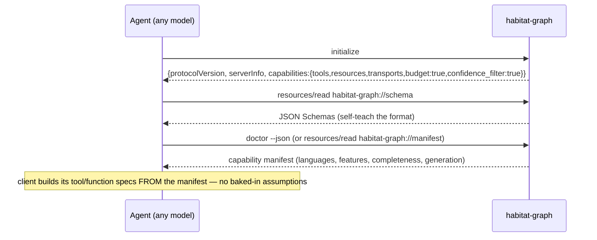

> Back to: [[CLAUDE.md]] · [[habitat-graph/README]] · [[EVIDENCE]] · **plan:** [[14_PLAN_V3_UNIFIED_PARITY_AGENTIC_S1008901]] · **V3 corpus:** [[15_FEATURE_ASSIMILATION_MATRIX_S1008901]] · [[16_ARCHITECTURE_SCHEMATICS_V3_S1008901]] · [[18_DIAGNOSTICS_OBSERVABILITY_V3_S1008901]]
> **extends:** [[12_LLM_FRIENDLY_API_AND_UDS_S1008796]] §E (single-section model notes → this full contract).

# habitat-graph — Cross-Model Agentic Contract (Claude 4.8+ / GPT-5.5+, S1008901)

The contract that makes habitat-graph **effortless, effective, and impactful to drive for any frontier
agentic LLM** — Claude Code 4.8+ and GPT-5.5+ as the named first-class targets, **model-agnostic** so
"and above" (and Gemini-class, Grok-class) inherit it for free. Realized in Phase **A3**; its
primitives (resources, budget, typed errors, generation) land in A0/A1. Design only.

---

## 1. Design axioms (what makes a tool model-native)

A frontier model drives a tool best when:
1. **It can read data as a resource**, no planning hop to pick a tool (MCP `resources/*`).
2. **The schema tells it exactly what comes back** (typed inputSchema + machine manifest).
3. **Outputs are typed + deterministic** → cacheable by `(query, generation)`.
4. **It knows what it is NOT seeing** (completeness envelope) → never hallucinates absent edges.
5. **It fits the model's window** (token-budgeted serve).
6. **Errors are typed for control flow** (`kind`), never prose to parse.
7. **One contract, every model** — no Claude-only or GPT-only path; capability negotiation, not hard-coding.

Axiom 7 is the load-bearing one for D-D: the surface is **model-agnostic**; Claude/GPT/others differ only in *transport binding*, not in the contract.

---

## 2. Transport binding per model (same handler underneath)

`serve::mcp::handle_jsonrpc` is a pure `&str → String`; every model reaches it through a binding ([[16_ARCHITECTURE_SCHEMATICS_V3_S1008901]] §7).

| Model class | Native binding | How it mounts | Notes |
|---|---|---|---|
| **Claude Code 4.8+** | **MCP (native)** | `install` writes the Claude Code MCP config; tools+resources auto-discovered via `tools/list`+`resources/list` | the first-class path; zero glue |
| **GPT-5.5+** (function-calling) | **MCP↔function-call bridge** (XM, A3) **or** direct HTTP/UDS | bridge translates `tools/list` → an OpenAI-style `tools[]` array; `doctor --json` (§4) auto-generates function specs | also drives HTTP `/query`/`/path` directly |
| Architect `:8144` / fleet | **UDS warm-daemon** | one `ArcSwap<Graph>`, many agents, sub-ms | the factory hot-loop path |
| any future model | inherits via capability negotiation (§3) | discovers surface from the manifest, no code change | "and above" future-proofing |

## 3. Capability negotiation (no hard-coding, future-proof)

The organ **self-describes**; the client adapts. No model name is special-cased.



The `capabilities` block tells the client which optional features exist (`budget`, `confidence_filter`, `resources`, `uds`) so a model only uses what's present — older organ + newer model, or vice-versa, negotiate gracefully.

## 4. The capability manifest (`doctor --json` / `habitat-graph://manifest`)

```json
{ "name":"habitat-graph", "version":"…", "schema_version":"habitat-graph.graph.v0",
  "capabilities":{
    "tools":["graph_query","graph_path","graph_health"],
    "resources":["graph","node","community","report","schema","manifest"],
    "transports":["cli","http","mcp-stdio","uds"],
    "budget":true, "confidence_filter":true, "typed_errors":true },
  "languages":["rust","python","ts","js","go","java","c","cpp","ruby","csharp","kotlin","scala","php"],
  "features":{"live":false,"net":false,"pdf":false,"vision":false},
  "graph":{"nodes":N,"edges":E,"communities":C,"generation":"<hash>","stale":false},
  "completeness":{"node_coverage_pct":97,"structural_pct":96,
    "edge_classes_emitted":["calls","method","contains","inherits","imports_from"],
    "edge_classes_omitted":["uses"],
    "per_language":{"ts":{"node_pct":88,"struct_pct":74}, "...":{}}} }
```
A GPT-5.5+ tool-router turns `capabilities.tools` + the `inputSchema` resources directly into its `tools[]`; a Claude client reads the same via MCP. **One source, both clients.**

## 5. Token-budget contract (fit any window)

`graph_query(query, confidence?, max_tokens=K)` and `habitat-graph://node/{label}?budget=K` return a **greedily-packed, relevance-ordered subgraph that fits K** ([[12_LLM_FRIENDLY_API_AND_UDS_S1008796]] §C):
- seed = matched/scope nodes; expand by budget-bounded BFS ordered `degree × proximity × confidence`; **never drop the seed**; stop at the K estimate.
- estimate: cheap char/heuristic default; `tiktoken-rs` behind a feature for exactness (note: tiktoken is GPT-tokenizer-shaped — for Claude the heuristic + a configurable chars/token ratio avoids mis-budgeting; the contract exposes `tokenizer: "heuristic"|"tiktoken"` so a client knows the estimate basis).
- output declares truncation: `{nodes_included, nodes_total, budget, truncated}` (ties to the envelope, axiom 4).

> **Multi-model nuance (flagged):** token estimates differ across model tokenizers. The contract returns the *estimate basis* so a client can apply its own safety margin; the organ never silently over-fills a window. A per-model chars/token ratio is a config, not a code fork.

## 6. Determinism = cross-model cacheability

R4 canonical ordering + seeded Leiden ⇒ *same source → byte-identical graph → identical answers.* Every response carries `generation` (content hash). Any model caches by `(query, generation)` and re-asks only when `generation` changes — a **correctness** feature for a multi-agent fleet (no two agents get divergent answers for the same graph state).

## 7. Typed errors (control flow, not prose)

JSON-RPC `error.data.kind ∈ {graph_unavailable, stale_graph, budget_exceeded, not_found, invalid_scope, feature_disabled}` + `retryable:bool`. The model branches on `kind`; mapped from `core::GraphError::kind()`. Example:
```json
{"code":-32004,"message":"served graph is stale","data":{"kind":"stale_graph","retryable":true,"generation":"<hash>","source_mtime":"…"}}
```

## 8. Tool descriptions written FOR a model (prompt-shaping)

Each tool/resource description states **what it returns and its limits**, so the model needs no external doc:
- `graph_query`: *"Search code-graph nodes whose label contains a substring (case-insensitive). Returns the most relevant matches packed to fit `max_tokens`, with a completeness envelope; up to the full match set, true total always reported. Use `confidence:\"EXTRACTED\"` for load-bearing wiring decisions."*
- `graph_path`: *"Shortest undirected path between two node labels (deterministic BFS). Returns the hop sequence or a typed not-found."*
- `habitat-graph://node/{label}`: *"The node plus its 1-hop typed-edge neighborhood; accepts `?budget=K`."*

## 9. The cross-model test matrix (XM-1…XM-7) — how D-D is PROVEN

Acceptance for FO-11. Run against **Claude Code 4.8+** (MCP) **and** **GPT-5.5+** (bridge/HTTP). A row passes only if both model classes pass.

| XM | Assertion | Method |
|---|---|---|
| XM-1 | `initialize`+`tools/list`+`resources/list` discovered, no hard-coded names | live MCP (Claude) + bridge (GPT) handshake |
| XM-2 | `resources/read habitat-graph://node/{label}` returns typed neighborhood | round-trip both clients |
| XM-3 | `graph_query(max_tokens=K)` output ≤ K under each model's tokenizer basis | budget test × 2 tokenizers |
| XM-4 | completeness envelope present + agent declines to infer an omitted `uses` edge | prompted reasoning probe |
| XM-5 | `confidence:"EXTRACTED"` filter respected end-to-end | filter test |
| XM-6 | typed `kind` errors branch correctly (stale/budget/not_found) | fault-injection |
| XM-7 | determinism — identical `(query, generation)` answer across both models + cache hit | cross-model equivalence |

> Harness note: the XM matrix runs in a bounded model harness (`fixtures` + a thin live-model lane); it is the only part of the plan that calls live models, and it is **read-only** against the organ. Live model calls route per habitat policy (7.3, TIERWRIGHT for any model-side work).

## 10. Worked sessions

**Claude Code 4.8+ (native MCP):**
```text
initialize → resources/read habitat-graph://schema   (learn format)
tools/call graph_query {query:"SchedulerLoop", confidence:"EXTRACTED", max_tokens:1500}
  → budgeted subgraph + envelope{coverage_pct, omitted:["uses"], generation:G}
tools/call graph_path {from:"SchedulerLoop", to:"EventBus"} → 3-hop path
cache by (query, G); re-query only on generation change
```

**GPT-5.5+ (function-calling via bridge):**
```text
GET doctor --json  → tool-router auto-builds function specs from capabilities+schemas
call graph_query({query:"SchedulerLoop", max_tokens:1500})   # same contract, function-call shape
  → same envelope; tokenizer:"tiktoken" basis honored
on error.data.kind=="stale_graph" → wait + re-call (retryable:true)
```

---

## 11. Decisions affecting this contract (→ doc 14 §7)

- **7.3** backend/embedding/vision policy (TIERWRIGHT routing) governs any model-side work this contract triggers.
- **7.4** `tiktoken-rs` (optional, budget exactness) — heuristic default keeps the contract model-agnostic without it.
- **7.6** `--feature live` split — the cross-model harness uses read-only surfaces; live actuation stays arming-gated.
- **Open (new) XM-D1:** add Gemini-class / Grok-class as named XM targets too? *Recommendation: the contract is model-agnostic by axiom 7 — add them to the XM matrix as lanes when a habitat consumer needs them; no contract change required.*

---
*Cross-model agentic contract S1008901 (2026-06-28) · Claude @ cortex. Primitives land A0/A1; proven in A3. Extends [[12_LLM_FRIENDLY_API_AND_UDS_S1008796]] §E. Diagnostics that back the envelope/manifest → [[18_DIAGNOSTICS_OBSERVABILITY_V3_S1008901]].*
