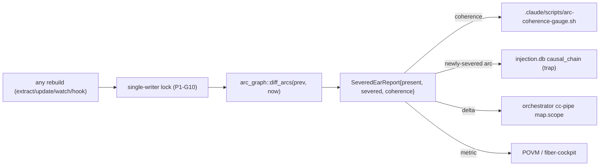
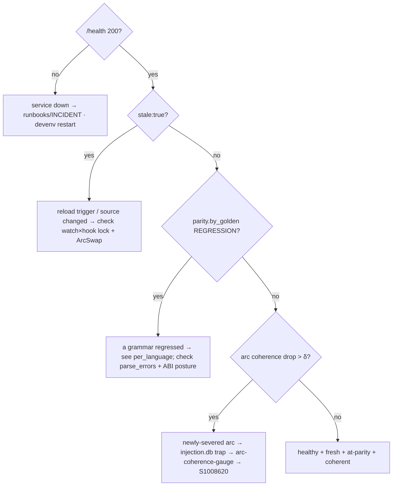

> Back to: [[CLAUDE.md]] · [[habitat-graph/README]] · [[EVIDENCE]] · **plan:** [[14_PLAN_V3_UNIFIED_PARITY_AGENTIC_S1008901]] · **V3 corpus:** [[15_FEATURE_ASSIMILATION_MATRIX_S1008901]] · [[16_ARCHITECTURE_SCHEMATICS_V3_S1008901]] · [[17_CROSS_MODEL_AGENTIC_CONTRACT_S1008901]] · [[19_PLAN_SCHEMATIC_MAP_S1008901]] · **ops runbook:** [[V3_LIVE_ORGAN_RUNBOOK_S1008901]]
> **extends:** [[13_DIAGNOSTICS_AND_OBSERVABILITY_S1008796]] (agent/operator self-describe, arc-graph telemetry) — this doc adds the **full-parity diagnostics** (per-grammar, ABI, parity-regression, semantic/DoS).

# habitat-graph — Diagnostics & Observability v3 (full-parity surface, S1008901)

What the organ must *tell* its three readers — an **operator** (healthy/fresh/deployed?), an **agent**
(what can I trust, per language?), and the **cognitive loops** (did the architecture move, is an arc
severed?) — once it spans **13 grammars + all exporters + the semantic path**. Design only. Built
surfaces: `cli::meta::doctor`, `daemon::handlers::health_json`, `serve::mcp`, `habitat::arc_graph`.

The doc-13 surfaces (capability manifest, completeness envelope, generation/stale, arc-graph
telemetry, tracing) stand. v3 adds the **per-grammar** and **parity-breadth** diagnostics that only
become necessary when the organ is no longer rust+python.

---

## 1. Per-grammar completeness — the headline new diagnostic (the §3.0 seam)

When the organ covers 13 grammars at *different* maturities, a single `coverage_pct` is a lie. Every
health/manifest/query response carries **per-language** completeness so an agent never makes a TS
wiring decision on an 88%-supported grammar as if it were the 97% Python path.

```json
"completeness": {
  "node_coverage_pct": 95, "structural_pct": 92,        // weighted across loaded languages
  "edge_classes_omitted": ["uses"],                     // the deliberate 0/156 divergence (EVIDENCE D2)
  "per_language": {
    "rust":   {"node_pct": 99, "struct_pct": 98, "parse_errors": 0,  "maturity": "stable"},
    "python": {"node_pct": 97, "struct_pct": 96, "parse_errors": 0,  "maturity": "oracle"},
    "ts":     {"node_pct": 88, "struct_pct": 74, "parse_errors": 3,  "maturity": "beta"},
    "go":     {"node_pct": 91, "struct_pct": 80, "parse_errors": 1,  "maturity": "beta"}
  } }
```
- **`maturity ∈ {oracle, stable, beta, experimental}`** per grammar — a machine signal an agent gates on.
- **`parse_errors` per language** is a silent-quality signal today (a grammar that half-fails still "succeeds"). Surfacing it makes a degrading grammar observable, not invisible.
- This is the runtime form of the §1A FO-8 per-grammar gate (doc 14) and the doc-15 B-table envelope column.

## 2. ABI-matrix health (PA prerequisite, observable)

`doctor --json` surfaces the resolved ABI posture so the operator sees drift before a grammar silently breaks:
```json
"abi": { "tree_sitter_core": "0.25.x (ABI 15)", "tree_sitter_language": "0.1",
  "grammars": {"ts":"aligned","js":"aligned","go":"aligned","scala":"aligned","kotlin":"substituted(kotlin-ng)"},
  "substituted": ["kotlin→kotlin-ng"], "deferred": [] }     // resolved S1008901 (abi-matrix-s1008901); no silent drop
```
Ties to [[16_ARCHITECTURE_SCHEMATICS_V3_S1008901]] §3. A grammar listed `DEFERRED` here is a tracked §7 decision, not a gap.

## 3. Parity-regression as a standing diagnostic (per language, per golden)

Doc 13 §4 made the *aggregate* parity run observable; v3 makes it **per-golden, per-language**, so a single grammar's regression is caught without re-reading a CI log:
```json
"parity": {
  "last_run": "<generation/ts>",
  "by_golden": {
    "httpx-python":  {"node_pct": 97, "struct_pct": 96, "verdict": "PASS"},
    "<corpus>-ts":   {"node_pct": 88, "struct_pct": 74, "verdict": "PASS"},
    "<corpus>-go":   {"node_pct": 79, "struct_pct": 71, "verdict": "REGRESSION"}   // ← below node≥80
  } }
```
**Threshold:** any golden dropping below `node≥80% + structural≥70%` = REGRESSION (the only parity failure class). Surfaced in `doctor --json` so drift is observable continuously, not only at the gate.

## 4. arc-graph severed-ear — continuous factory-wiring telemetry (carried + extended, A2)

The killer diagnostic from doc 13 §3 stands. v3 extension: the delta now rides on **every** rebuild path (extract / `--update` / `--watch` / hook), gated by the single-writer lock so concurrent rebuilds don't emit racing deltas.


- **Live writes arming-gated** (`factory.authorize.habitat-graph`, armed S1008901); read-only telemetry is not.
- **Alarm:** coherence drop > δ or any newly-severed *declared* arc = a factory-wiring alert. Auto-detects the severed bidi-wiring arcs S1008620 hand-builds today (the organ's pay-in to that workstream).

## 5. Semantic / multimodal path observability (PE)

The model-backed path needs its own diagnostics so a silent backend failure or a DoS attempt is visible:
```json
"semantic": { "backend": "noop|ollama|openai|tierwright", "is_local": true,
  "calls": {"attempted": N, "succeeded": N, "rejected_dos": N, "timeouts": N},
  "dos_caps": {"max_bytes": …, "timeout_ms": …, "max_mem_mb": …} }       // C-2 caps, observable
```
- **`is_local` audit** is a first-class health field — confirms code extraction never silently reached a model (the local-first invariant, `EVIDENCE.md:64`).
- **`rejected_dos`** counts pdf/url/vision inputs blocked by the C-2 caps — a security signal, not a hidden drop.
- vision/pdf calls route via TIERWRIGHT (7.3); a TIERWRIGHT outage surfaces here as `timeouts`, not as a corrupt graph.

## 6. Tracing + per-stage metrics (extended to 13 grammars)

`tracing` spans per stage (`--json-logs`), with the extract metrics now **per grammar**:
```json
"extract_metrics": {
  "stage_durations_ms": {"detect":…,"extract":…,"build":…,"analyze":…,"export":…},
  "per_language": {"rust":{"files":N,"nodes":N,"edges":N,"parse_errors":0}, "ts":{…}},
  "analyze": {"leiden_ms":…, "incremental": false, "communities_reclustered": "all"} }  // C-4 honesty
```
- `analyze.incremental:false` + `communities_reclustered:"all"` make the C-4 truth observable (file-cache is not full incrementality; Leiden re-runs globally — measured, not claimed).
- Never `println!` diagnostics on stdout — stdout is the data contract (`cli`).

## 7. The three readers (Diátaxis split, v3)

| Reader | Needs (v3 additions in **bold**) | Surface |
|---|---|---|
| **Operator** | deployed/healthy/fresh? rollback? **ABI posture? which grammar regressed?** | `doctor` prose · `/health` · `cc-health` · runbooks · **`abi`+`parity.by_golden`** |
| **Agent** | trust, missing, stale, how to call — **per language** | `doctor --json` · **per-language completeness + `maturity`** · typed errors · `generation` · `://schema` |
| **Cognitive loops** | architecture moved? arc severed? | arc-graph telemetry (§4) · graph-delta push (AGT-5) · severed-ear → injection.db |

## 8. Diagnostics backlog mapped to v3 phases

| Diagnostic | Phase | Effort |
|---|---|---|
| `doctor --json` manifest + freshness (seam) | start of PA | SMALL |
| **per-grammar completeness + `maturity` + `parse_errors`** | PA (per grammar) | tracks PA |
| **ABI-matrix health field** | PA (after G-ABI) | SMALL |
| **per-golden/per-language parity-regression field** | PA | SMALL |
| `/health`+`graph_health` generation/stale | A0 | SMALL |
| completeness envelope on every response | A0 (full) | MED |
| typed `kind` errors at agent boundary | A0 | SMALL-MED |
| `tracing` spans + `--json-logs` + per-stage/-grammar metrics | PA→A1 | MED |
| **semantic path observability (`is_local`, `rejected_dos`)** | PE | SMALL |
| arc-graph continuous severed-ear telemetry | A2 | MED (live writes arming-gated) |
| cross-model harness observability (XM) | A3 | tracks A3 |

## 9. Quick diagnostic decision tree (operator)



---
*Diagnostics & observability v3 S1008901 (2026-06-28) · Claude @ cortex. Extends [[13_DIAGNOSTICS_AND_OBSERVABILITY_S1008796]]. Built surfaces: `cli::meta`, `daemon::handlers`, `habitat::arc_graph`. Proposals are plan-v3 ([[14_PLAN_V3_UNIFIED_PARITY_AGENTIC_S1008901]]); no code until "start coding".*
