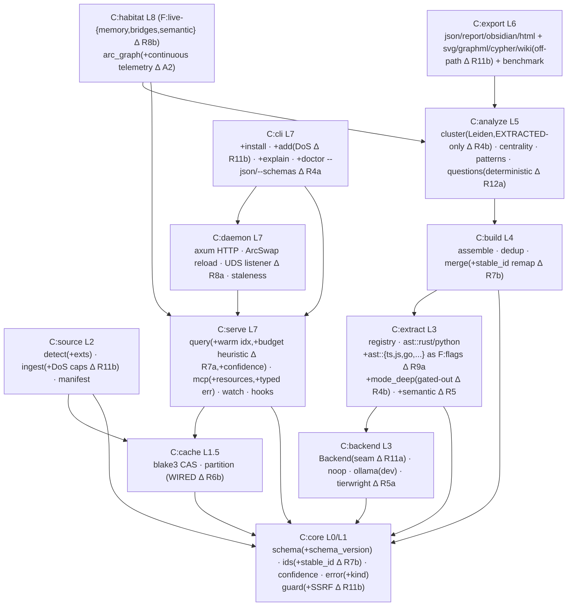
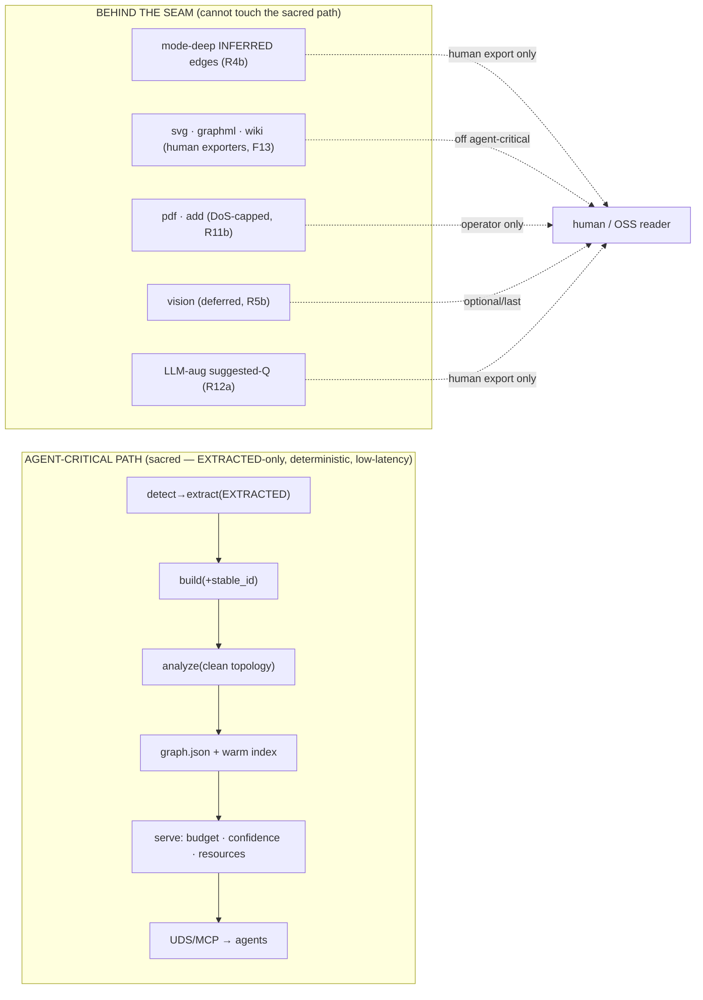
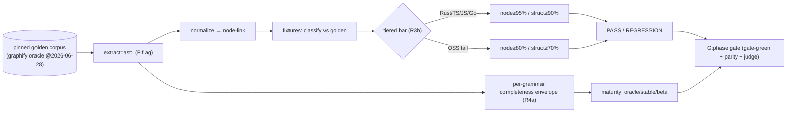
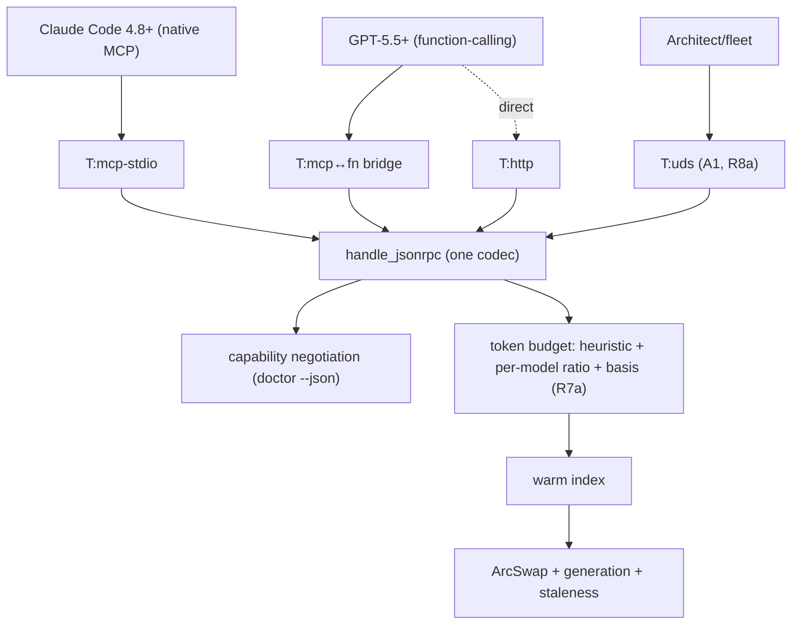
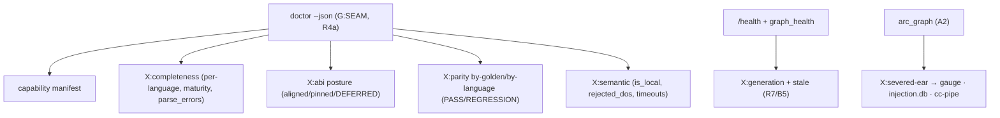
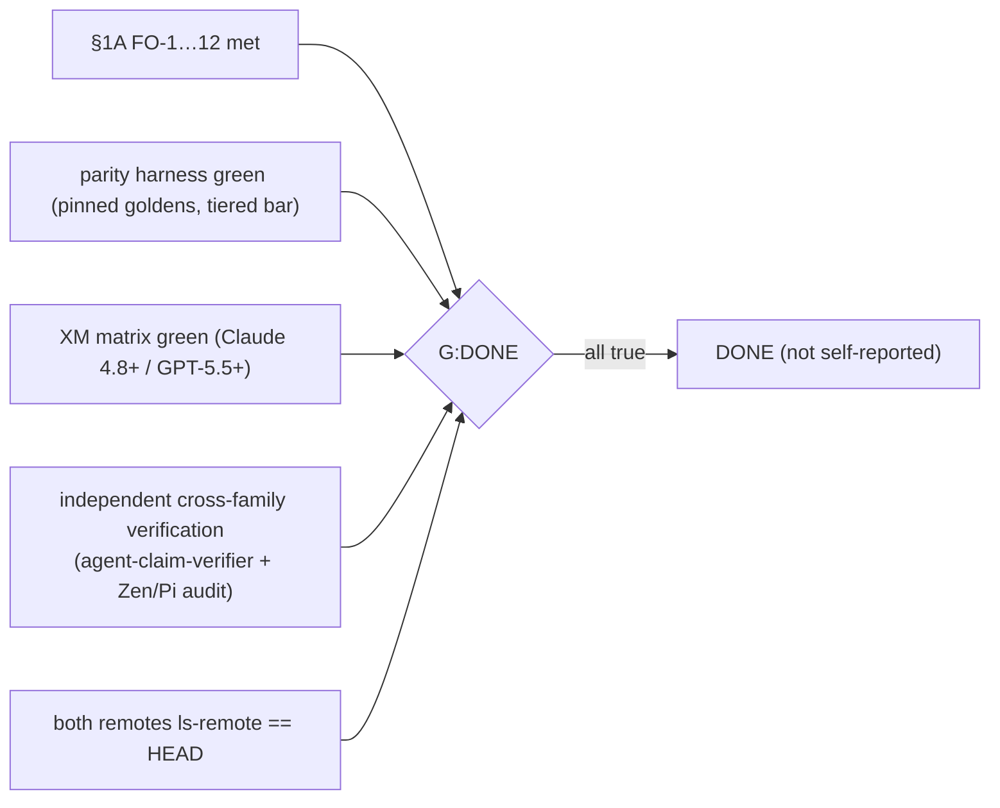

> Back to: [[CLAUDE.md]] · [[habitat-graph/README]] · [[EVIDENCE]] · **plan:** [[14_PLAN_V3_UNIFIED_PARITY_AGENTIC_S1008901]] · **V3 corpus:** [[15_FEATURE_ASSIMILATION_MATRIX_S1008901]] · [[16_ARCHITECTURE_SCHEMATICS_V3_S1008901]] · [[17_CROSS_MODEL_AGENTIC_CONTRACT_S1008901]] · [[18_DIAGNOSTICS_OBSERVABILITY_V3_S1008901]]
> **reflects:** the ratified plan after the S1008901 12-round grill ([[14_PLAN_V3_UNIFIED_PARITY_AGENTIC_S1008901]] §7A). Every box here is post-grill state.

# habitat-graph — Plan Schematic Map (ratified, LLM-optimized) — S1008901

A single schematic map of the **current plan**: architectural designs · mappings · diagnostics ·
system architecture — each rendered **twice**: a human **Mermaid** view *and* a machine **edge-list**
(the data, not the layout). The whole plan is also emitted as one **node-link graph** (§10) in
habitat-graph's own `graph.json` schema — so the organ can ingest its own plan.

> [!llm] Machine-reading contract (read this first)
> - **Stable IDs.** Every node has a typed prefix: `P:` phase · `G:` gate · `D:` decision (grill round) · `C:` crate · `F:` feature-flag · `M:` module · `T:` transport · `X:` diagnostic. IDs are stable across this doc; cross-references use them verbatim.
> - **Edges are typed.** `precedes` · `gates` · `produces` · `depends` · `amends` · `routes` · `emits` · `feeds`. Read an edge as `source --relation--> target`.
> - **Determinism.** Nodes/edges are emitted in sorted ID order (R4) so a diff is meaningful.
> - **Every diagram is paired with its edge-list** under a `▸ edges` block — parse that, not the SVG.
> - Links in `[[…]]` resolve to corpus docs; this map never restates a doc, it *indexes* it.

---

## 1. The plan at a glance (ratified topology)

```mermaid
flowchart LR
  subgraph B1["BLOCK 1 — full graphify parity (agent-critical path sacred)"]
    PA1["P:PA-1 · grammars (factory-actual)\nTS · JS · Go · docs"]
    PA2["P:PA-2 · grammars (OSS tail)\njava c cpp ruby c# kotlin scala php"]
    PB["P:PB · exporters\nsvg · graphml · cypher · wiki (off-path)"]
    PC["P:PC · lifecycle\nupdate · watch · hook · install · add · mode-deep"]
    PD["P:PD · analytics (deterministic)\ngod-nodes · surprising · suggested-Q · token-bench"]
    PE["P:PE · semantic + pdf (vision deferred)"]
  end
  subgraph B2["BLOCK 2 — agentic + multi-model"]
    A0["P:A0 · front door\nresources · token-budget · typed errors · schema"]
    A1["P:A1 · warm + identity + UDS\nindex · stable_id · generation · UDS daemon"]
    A2["P:A2 · substrate payoff\narc-telemetry · delta-push · split-rebuild"]
    A3["P:A3 · cross-model\nClaude 4.8+ / GPT-5.5+ · XM matrix"]
  end
  GABI["G:ABI · tree-sitter core ABI matrix"]
  SEAM["G:SEAM · doctor --json + per-grammar envelope"]
  A4["P:A4 · OSS flip + crates.io\n(REMOVED from live seq — latent)"]

  GABI --> PA1
  SEAM --> PA1
  PA1 --> PA2 --> PB --> PC --> PD --> PE --> A0 --> A1 --> A2 --> A3
  A3 -. explicit-go only .-> A4
```



> ▸ edges (machine)
> ```
> G:ABI   gates    P:PA-1
> G:SEAM  gates    P:PA-1
> P:PA-1  precedes P:PA-2
> P:PA-2  precedes P:PB
> P:PB    precedes P:PC
> P:PC    precedes P:PD
> P:PD    precedes P:PE
> P:PE    precedes P:A0
> P:A0    precedes P:A1
> P:A1    precedes P:A2
> P:A2    precedes P:A3
> P:A3    precedes P:A4   [latent; explicit-go only]
> ```

> [!note] Ratified change vs doc 16 → PA is now **PA-1 ▸ PA-2** (factory-actual first, grill R2a); A4 is **off the live sequence** (R1a/R1b). Canonical: [[14_PLAN_V3_UNIFIED_PARITY_AGENTIC_S1008901]] §7A.

---

## 2. Decision graph — the 24 grill decisions → what they bind

```mermaid
flowchart TB
  D1["D:R1 stay private + no crates.io"] --> DOD["dual DoD: §1A live, §1B latent"]
  D2["D:R2 PA factory-first + pin-older ABI"] --> PA1b["P:PA-1/PA-2 split"]
  D3["D:R3 oracle pinned + tiered bar"] --> GATEB["G:parity tiered 95/90 · 80/70"]
  D4["D:R4 keep seam + deep-edges out"] --> CLEAN["agent graph = EXTRACTED-only"]
  D5["D:R5 TIERWRIGHT+Ollama-dev + vision deferred"] --> PEb["P:PE semantic+pdf"]
  D6["D:R6 measure+disclose + wire cache"] --> UPD["F:--update honest"]
  D7["D:R7 heuristic tokenizer + dual id"] --> IDN["M:stable_id + budget basis"]
  D8["D:R8 UDS in A1 + live split"] --> PRIV["F:live-memory/bridges/semantic"]
  D9["D:R9 feature-gated grammar modules + parity-bar tests"] --> CRATE["C:extract feature-gated"]
  D10["D:R10 Workflow fan-out + commit cadence"] --> METHOD["build method"]
  D11["D:R11 keep dropped + DoS-capped ingest"] --> SEAMX["Backend trait seam · pdf/url off-path"]
  D12["D:R12 deterministic analytics + cross-family DONE"] --> DONE["G:DONE"]
```



> ▸ edges (machine — decision binds artifact)
> ```
> D:R1  amends  DoD(§1A live,§1B latent); removes P:A4 from live seq
> D:R2  amends  P:PA(split PA-1/PA-2); sets G:ABI default=pin-older
> D:R3  amends  G:parity(tiered); pins oracle@2026-06-28
> D:R4  amends  G:SEAM(kept); gates F:mode-deep out of M:analyze
> D:R5  amends  P:PE(semantic+pdf); defers F:vision; routes T:semantic->TIERWRIGHT
> D:R6  amends  F:update(measure+disclose); wires C:cache
> D:R7  amends  M:budget(heuristic+basis); adds M:stable_id
> D:R8  adds    T:UDS@A1; splits F:live -> {memory,bridges,semantic}
> D:R9  amends  C:extract(per-grammar F:flags); G:tests(parity+meaningfulness)
> D:R10 amends  method(Workflow@PA/PB); cadence(commit-now + per-phase)
> D:R11 amends  Backend(trait seam); F:pdf,F:add-url(DoS-capped, off-path)
> D:R12 amends  M:analytics(deterministic); G:DONE(dual-DoD + cross-family verify)
> ```

> [!note] Full decision text + "amends" targets: [[14_PLAN_V3_UNIFIED_PARITY_AGENTIC_S1008901]] §7A. Feature-by-feature status: [[15_FEATURE_ASSIMILATION_MATRIX_S1008901]].

---

## 3. System architecture — ratified target (LLM-optimized)

The crate graph with the **grill deltas baked in** (feature-gated grammars, dual-id, live-split, UDS).
Acyclic + inward-only (Layer-D BMC discipline). `Δ` = changed by a grill decision.



> ▸ edges (machine — `depends`; `core` is the sink)
> ```
> C:source  depends C:core, C:cache
> C:extract depends C:core, C:backend
> C:backend depends C:core
> C:build   depends C:core, C:extract
> C:analyze depends C:build
> C:export  depends C:analyze
> C:cache   depends C:core
> C:daemon  depends C:serve
> C:serve   depends C:core, C:cache
> C:cli     depends C:serve, C:daemon
> C:habitat depends C:serve, C:analyze
> ```

> [!note] Built-state DAG (pre-plan): [[11_ARCHITECTURE_SCHEMATICS_S1008796]] §1. Full target Δ table: [[16_ARCHITECTURE_SCHEMATICS_V3_S1008901]] §9. `C:cache` moves from orphaned → load-bearing (R6b).

---

## 4. The sacred-path mapping — agent-critical vs behind-seam

The single invariant the grill carved out: **the agent-critical read path is sacred; all human/OSS
breadth lives behind a seam that cannot degrade it.** This map *is* that invariant.



> ▸ edges (machine — `on-path` vs `behind-seam`)
> ```
> PATH  members  detect,extract(EXTRACTED),build(stable_id),analyze,graph.json,warm-index,serve(budget+confidence+resources),UDS/MCP
> SEAM  members  mode-deep, svg, graphml, wiki, pdf, add-url, vision, llm-aug-suggested-Q
> RULE  invariant  SEAM members MUST NOT mutate PATH (no inferred edges in analyze; human artifacts off critical rebuild; F13 split)
> ```

> [!note] This invariant grew implicitly from the grill (R4b/R5b/R11b/R12a). Diagnostics enforce it observably: a SEAM member leaking onto PATH shows as a parity/topology regression in [[18_DIAGNOSTICS_OBSERVABILITY_V3_S1008901]] §3.

---

## 5. Dataflow + gate flow (parity build)



> ▸ edges (machine)
> ```
> corpus produces golden
> ext    produces node-link, completeness-envelope
> diff   gates    bar
> bar    routes   {factory-critical->95/90, oss-tail->80/70}   [R3b]
> env    produces maturity
> {verdict,maturity} feed G:phase-gate
> ```

> [!note] Oracle pinning + tiered bar + golden pipeline cost: [[14_PLAN_V3_UNIFIED_PARITY_AGENTIC_S1008901]] §7A R3, [[15_FEATURE_ASSIMILATION_MATRIX_S1008901]] §B.1.

---

## 6. Cross-model serving topology (ratified)



> ▸ edges (machine)
> ```
> T:mcp-stdio routes H   [client: Claude 4.8+]
> T:mcp-fn-bridge routes H [client: GPT-5.5+]
> T:http routes H          [client: any fn-caller]
> T:uds  routes H          [client: fleet/Architect, A1]
> H feeds capability-negotiation, token-budget(heuristic,R7a)
> token-budget feeds warm-index feeds ArcSwap(generation,staleness)
> ```

> [!note] Full contract + XM-1…7 test matrix: [[17_CROSS_MODEL_AGENTIC_CONTRACT_S1008901]]. Tokenizer basis nuance (Claude vs GPT): doc 17 §5 + R7a.

---

## 7. Diagnostics surface map (observability tree)



> ▸ edges (machine — diagnostic `emits` consumer)
> ```
> X:completeness emits agent(maturity gate)            [R3b/R4a]
> X:abi          emits operator(deferred-grammar list)  [R2b]
> X:parity       emits operator(regression alarm)
> X:semantic     emits operator(is_local audit, DoS count) [R5/R11b]
> X:generation   emits agent(cache key (query,generation)) [R7]
> X:severed-ear  emits loops(PV2,POVM,arc-coherence)        [A2, arming-gated]
> ```

> [!note] Per-grammar + ABI + parity-regression + semantic diagnostics: [[18_DIAGNOSTICS_OBSERVABILITY_V3_S1008901]] §§1-6. The operator decision tree: doc 18 §9.

---

## 8. The DONE gate (ratified acceptance, R12b)



> ▸ edges (machine — `G:DONE` requires ALL)
> ```
> G:DONE requires §1A-FO-1..12, parity-green, XM-green, cross-family-verify, remotes-current
> G:DONE rejects self-gate, evidence-ledger-only   [R12b]
> ```

---

## 9. Phase → produces → gate (compact mapping table)

| Phase | Produces (key) | Gate (ratified) | Notes |
|---|---|---|---|
| `G:ABI` | `abi-matrix-s1008901.md` + pin set | single core ABI chosen; conflicts pin-older/defer (logged) | blocks PA-1 · [[16_ARCHITECTURE_SCHEMATICS_V3_S1008901]] §3 |
| `G:SEAM` | `doctor --json` + envelope | manifest discoverable; per-grammar envelope present | R4a |
| `P:PA-1` | TS/JS/Go + docs extractors | tiered bar 95/90 + parity + maturity | factory-actual first (R2a) |
| `P:PA-2` | 8 OSS grammar extractors | bar 80/70 + parity + maturity | OSS tail |
| `P:PB` | svg/graphml/cypher/wiki | valid XML / parses / links resolve; off-path (F13) | R11b |
| `P:PC` | update/watch/hook/install/add/mode-deep | idempotent + analyze-cost-measured + SSRF + watch×hook lock | R6a/R4b/R11b |
| `P:PD` | god-nodes/surprising/suggested-Q/benchmark | deterministic; token math tested | R12a |
| `P:PE` | semantic + pdf (vision deferred) | off-by-default + is_local + DoS caps | R5/R11b |
| `P:A0` | resources/budget/typed-errors/schema | resources round-trip; budget ≤K | R7a |
| `P:A1` | warm index/stable_id/generation/UDS | flat latency; rename-stability; UDS reuses handler | R7b/R8a |
| `P:A2` | arc-telemetry/delta-push/split-rebuild | severed-ear delta reaches gauge; arming-gated | R8b |
| `P:A3` | XM cross-model matrix | XM-1…7 green on Claude 4.8+/GPT-5.5+ | R12b |
| `P:A4` | OSS flip + crates.io | LATENT — explicit-go only | R1a/R1b |

---

## 10. The plan as a graph — node-link (graph.json schema, LLM-native)

The whole plan as one node-link object in habitat-graph's own schema ([[12_LLM_FRIENDLY_API_AND_UDS_S1008796]] §A4). An agent (or the organ itself) can ingest this and query it — `graph_query`/`graph_path` over the plan. Determinism R4: nodes by id, links by `(source,target,relation)`.

```json
{ "directed": true, "multigraph": false, "graph": {"title":"habitat-graph plan v3 (ratified S1008901)"},
  "nodes": [
    {"id":"G:ABI","label":"tree-sitter ABI matrix","kind":"gate","blocks":"P:PA-1"},
    {"id":"G:SEAM","label":"doctor --json + envelope","kind":"gate","decision":"D:R4a"},
    {"id":"P:PA-1","label":"grammars factory-actual (ts/js/go/docs)","kind":"phase","bar":"95/90","maturity":true},
    {"id":"P:PA-2","label":"grammars OSS tail (8)","kind":"phase","bar":"80/70"},
    {"id":"P:PB","label":"exporters svg/graphml/cypher/wiki","kind":"phase","onpath":false},
    {"id":"P:PC","label":"lifecycle update/watch/hook/install/add/mode-deep","kind":"phase"},
    {"id":"P:PD","label":"analytics (deterministic)","kind":"phase","onpath":true},
    {"id":"P:PE","label":"semantic+pdf (vision deferred)","kind":"phase","routing":"TIERWRIGHT"},
    {"id":"P:A0","label":"front door: resources/budget/typed-errors/schema","kind":"phase"},
    {"id":"P:A1","label":"warm index/stable_id/generation/UDS","kind":"phase"},
    {"id":"P:A2","label":"arc-telemetry/delta-push/split-rebuild","kind":"phase","armed":true},
    {"id":"P:A3","label":"cross-model XM matrix","kind":"phase","models":["claude-4.8+","gpt-5.5+"]},
    {"id":"P:A4","label":"OSS flip + crates.io","kind":"phase","status":"latent"},
    {"id":"G:DONE","label":"dual-DoD + cross-family verify","kind":"gate","decision":"D:R12b"},
    {"id":"INV:PATH","label":"agent-critical path sacred","kind":"invariant"}
  ],
  "links": [
    {"source":"G:ABI","target":"P:PA-1","relation":"gates","confidence":"EXTRACTED"},
    {"source":"G:SEAM","target":"P:PA-1","relation":"gates","confidence":"EXTRACTED"},
    {"source":"P:PA-1","target":"P:PA-2","relation":"precedes","confidence":"EXTRACTED"},
    {"source":"P:PA-2","target":"P:PB","relation":"precedes","confidence":"EXTRACTED"},
    {"source":"P:PB","target":"P:PC","relation":"precedes","confidence":"EXTRACTED"},
    {"source":"P:PC","target":"P:PD","relation":"precedes","confidence":"EXTRACTED"},
    {"source":"P:PD","target":"P:PE","relation":"precedes","confidence":"EXTRACTED"},
    {"source":"P:PE","target":"P:A0","relation":"precedes","confidence":"EXTRACTED"},
    {"source":"P:A0","target":"P:A1","relation":"precedes","confidence":"EXTRACTED"},
    {"source":"P:A1","target":"P:A2","relation":"precedes","confidence":"EXTRACTED"},
    {"source":"P:A2","target":"P:A3","relation":"precedes","confidence":"EXTRACTED"},
    {"source":"P:A3","target":"P:A4","relation":"precedes","confidence":"INFERRED"},
    {"source":"P:A3","target":"G:DONE","relation":"feeds","confidence":"EXTRACTED"},
    {"source":"INV:PATH","target":"P:PB","relation":"constrains","confidence":"EXTRACTED"},
    {"source":"INV:PATH","target":"P:PE","relation":"constrains","confidence":"EXTRACTED"}
  ] }
```

> [!note] `confidence:"INFERRED"` on `P:A3→P:A4` encodes that A4 is latent (R1a) — the same EXTRACTED/INFERRED trust signal the organ uses on real graphs. The plan-graph obeys the plan's own contract.

---

## 11. Corpus cross-reference (bidirectional index)

| This map §  | Indexes (canonical) |
|---|---|
| §1 roadmap | [[14_PLAN_V3_UNIFIED_PARITY_AGENTIC_S1008901]] §3, §7A |
| §2 decisions | [[14_PLAN_V3_UNIFIED_PARITY_AGENTIC_S1008901]] §7A |
| §3 system arch | [[16_ARCHITECTURE_SCHEMATICS_V3_S1008901]] · built-state [[11_ARCHITECTURE_SCHEMATICS_S1008796]] |
| §4 sacred path | [[18_DIAGNOSTICS_OBSERVABILITY_V3_S1008901]] §3 (enforcement) |
| §5 parity dataflow | [[15_FEATURE_ASSIMILATION_MATRIX_S1008901]] §B · [[06_PARITY_INTEL]] |
| §6 cross-model | [[17_CROSS_MODEL_AGENTIC_CONTRACT_S1008901]] |
| §7 diagnostics | [[18_DIAGNOSTICS_OBSERVABILITY_V3_S1008901]] |
| §8 DONE gate | [[14_PLAN_V3_UNIFIED_PARITY_AGENTIC_S1008901]] §8, §7A R12b |
| §10 plan-graph | [[12_LLM_FRIENDLY_API_AND_UDS_S1008796]] §A4 (schema) |

---
*Plan schematic map (ratified, LLM-optimized) S1008901 (2026-06-29) · Claude @ cortex. Every box reflects the post-grill plan ([[14_PLAN_V3_UNIFIED_PARITY_AGENTIC_S1008901]] §7A). Human Mermaid + machine edge-list + a node-link plan-graph the organ can ingest. No code until "start coding".*
