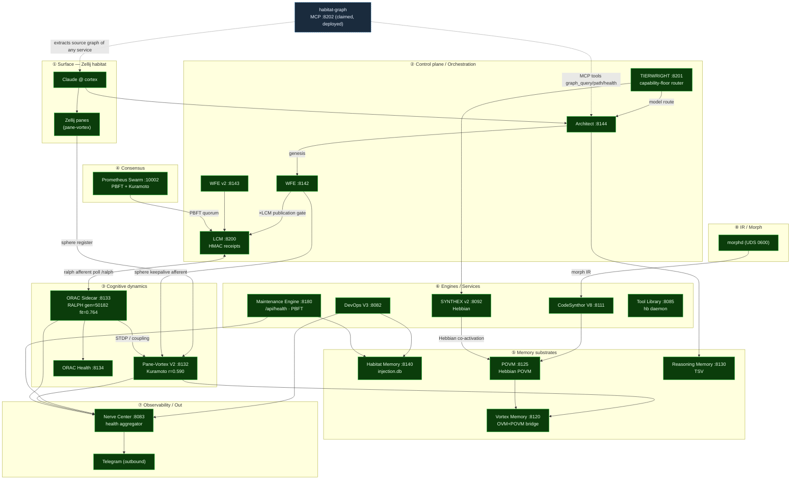

> Back to: [[CLAUDE.md]] · [[habitat-graph/README]] · [[EVIDENCE]] · [[02_HABITAT_INTEGRATION]]

# ULTRAPLATE Habitat — Live Service Stack (end-to-end) · S1008796

> Probed live `2026-06-27`: **cc-health 19/19 up** + direct `/health` confirm. PV2 Kuramoto `r=0.590`,
> ORAC RALPH `gen=50182 fit=0.764`, VMS `mem=4678`. morphd UDS present (`0600`); telegram outbound (no port).
> This is the **runtime topology** (live dataflow), not a source-symbol graph. `habitat-graph` (this repo)
> is the dashed organ at `:8202` — it graphs the *source* of any service here and serves `graph_query/path/health` over MCP.

## Comms backbone (cross-cutting, not edges above)
`cc-pipe <swarm|hab|nexus>` plugin-pipe (µs–ms) · **Atuin KV** (~1.6k keys, durable, works when all
services down) · **PV2 UDS bus** (high-rate) · `fleet-ctl` (~6s fallback). Router: `comms-mesh` + `ladders.json`.

## Layer legend
① surface ② control/orchestration ③ cognitive dynamics ④ consensus ⑤ memory ⑥ engines ⑦ observability
⑧ IR. Solid = grounded dataflow; dashed = the deployed `habitat-graph` organ (graphs the *source* of any
of these codebases on demand, and exposes `graph_query/path/health` as MCP tools to the orchestrator).

---
*Live probe + schematic S1008796 · Claude @ cortex. Canonical workspace mirror: `ai_docs/HABITAT_LIVE_SERVICE_STACK_SCHEMATIC_S1008796.md`.*
