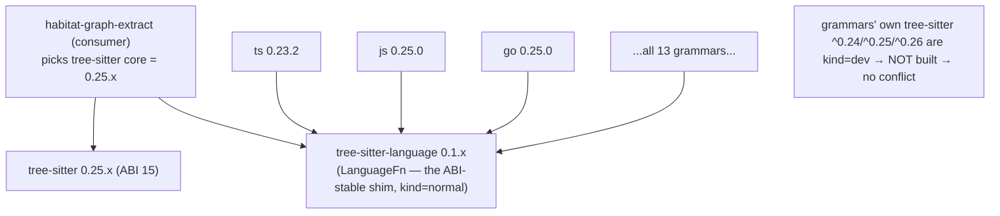

> Back to: [[CLAUDE.md]] · [[habitat-graph/README]] · [[EVIDENCE]] · **gate owner:** [[14_PLAN_V3_UNIFIED_PARITY_AGENTIC_S1008901]] §6 (G-ABI) · **schematic:** [[16_ARCHITECTURE_SCHEMATICS_V3_S1008901]] §3 · **feature matrix:** [[15_FEATURE_ASSIMILATION_MATRIX_S1008901]] §B · **diagnostics:** [[18_DIAGNOSTICS_OBSERVABILITY_V3_S1008901]] §2 (abi health field) · **ops:** [[V3_LIVE_ORGAN_RUNBOOK_S1008901]] §4 (grammar ops)

# G-ABI — tree-sitter core-ABI Matrix (S1008901)

> **Gate G-ABI (doc 14 §6): the hard prerequisite that blocks PA-1.** Pick ONE `tree-sitter` core the
> whole grammar set can share; for any grammar that can't align, record the resolution (pin-older /
> vendor / **defer**, R2b) — **no silent drop.** Data: live crates.io API, **2026-06-29** (versions +
> dependency *kind*), cross-checked against the repo's resolved `Cargo.lock`.

## 0. VERDICT — **PASS** ✅ (G-ABI cleared; PA-1 unblocked)

**Standardize on `tree-sitter` core `0.25.x` (ABI 15) + `tree-sitter-language 0.1`. Take EVERY grammar
at its latest stable. Zero pins-older · zero vendoring · zero defers.** One-time cost: bump the core
from the current `0.22.6` and migrate the existing rust/python extractors to the `LanguageFn` API.

> Core `0.26.x` is an identical-ABI drop-in if a newer-core fix is ever needed — the choice is free
> (see §2). `0.25.x` recommended: it is the version the plurality of factory-relevant grammars
> currently dev-test against, and ABI 15 is unchanged across 0.24–0.26.

## 1. The methodology trap this gate exists to catch (READ THIS)

`cargo-deny` checks licenses/advisories — **not ABI** (doc 14 §6). But the deeper trap is subtler:

| Naive read (WRONG) | Ground truth (verified) |
|---|---|
| Each grammar's `tree-sitter` `req` is its core constraint → TS caps `^0.24`, JS needs `^0.25.8`, Kotlin `<0.23` → **irreconcilable conflict** | Those `tree-sitter` reqs are **`kind=dev`** (the maintainer's test core) — **cargo does not build dev-deps of dependencies**, so they never enter your tree |
| → pick core 0.24, pin 8 grammars older | The only **`kind=normal`** runtime dep is **`tree-sitter-language ^0.1`** — *every* modern grammar agrees on it → they unify cleanly under any modern core |

The fix only surfaced by querying the dependency **`kind`** (`shortcut-over-ground-truth`). The real
consumer-side constraints are just two: (a) one `tree-sitter-language 0.1.x` (all grammars want
`^0.1`); (b) the core's ABI window (MIN_COMPATIBLE 13 .. LANGUAGE_VERSION 15 for 0.23–0.26) covers
each grammar's compiled ABI (14/15). Both hold for core 0.25.x. `tree_sitter::Language: From<LanguageFn>`
since core 0.23, so `parser.set_language(&tree_sitter_<lang>::LANGUAGE.into())` is the call shape.

## 2. Why the core is free to be latest (the conflict dissolves)



## 3. The verified grammar matrix (crates.io, 2026-06-29)

`real dep` = the `kind=normal` runtime dep (the binding constraint). `dev (info)` = the grammar's
test-only `tree-sitter` req — informational, **does not constrain the consumer**.

| Grammar (PA tier) | crate | latest stable | real dep (normal) | dev (info) | resolution |
|---|---|---|---|---|---|
| rust (built) | `tree-sitter-rust` | **0.24.2** | `tree-sitter-language ^0.1` | ts ^0.25 | **upgrade** 0.21.2→0.24.2 (migrate API) |
| python (oracle) | `tree-sitter-python` | **0.25.0** | `tree-sitter-language ^0.1` | ts ^0.25.8 | **upgrade** 0.21.0→0.25.0 (migrate API) |
| **typescript** (critical) | `tree-sitter-typescript` | **0.23.2** | `tree-sitter-language ^0.1` | ts ^0.24 | latest ✓ |
| **javascript** (critical) | `tree-sitter-javascript` | **0.25.0** | `tree-sitter-language ^0.1` | ts ^0.25.8 | latest ✓ |
| **go** (critical) | `tree-sitter-go` | **0.25.0** | `tree-sitter-language ^0.1` | ts ^0.25.8 | latest ✓ |
| java | `tree-sitter-java` | **0.23.5** | `tree-sitter-language ^0.1` | ts ^0.24 | latest ✓ |
| c | `tree-sitter-c` | **0.24.2** | `tree-sitter-language ^0.1` | ts ^0.25.4 | latest ✓ |
| cpp | `tree-sitter-cpp` | **0.23.4** | `tree-sitter-language ^0.1` | ts ^0.24 | latest ✓ |
| ruby | `tree-sitter-ruby` | **0.23.1** | `tree-sitter-language ^0.1` | ts ^0.24 | latest ✓ |
| c# | `tree-sitter-c-sharp` | **0.23.5** | `tree-sitter-language ^0.1` | ts ^0.25 | latest ✓ |
| **kotlin** | ~~`tree-sitter-kotlin`~~ → **`tree-sitter-kotlin-ng`** | **1.1.0** | `tree-sitter-language ^0.1` | ts ^0.24 | **SUBSTITUTE** (see §4) |
| scala | `tree-sitter-scala` | **0.26.0** | `tree-sitter-language ^0.1` | ts ^0.26 | latest ✓ |
| php | `tree-sitter-php` | **0.24.2** | `tree-sitter-language ^0.1` | ts ^0.25 | latest ✓ |
| docs/text | (internal `ast::text`) | — | none | — | no grammar dep |

**Every `real dep` column is identical (`tree-sitter-language ^0.1`) → the set unifies. 12 grammars at
latest + 1 maintained substitution. Nothing pinned older; nothing deferred.**

## 4. The one substitution (Kotlin — logged, not dropped, R2b)

`tree-sitter-kotlin` 0.3.8 is the **only** grammar still on the pre-`tree-sitter-language` world
(real-dep `tree-sitter >=0.21,<0.23`, `kind=normal`) — it is unmaintained on ABI 14 and **cannot**
join a modern core. Resolution: substitute the **maintained fork `tree-sitter-kotlin-ng` 1.1.0**
(`tree-sitter-language ^0.1`, normal). Logged here so the `abi` diagnostic field reports
`kotlin: substituted(kotlin-ng)`, never a silent swap. *Alternate also available: `tree-sitter-kotlin-sg`
0.4.1 (`^0.1`).* **Verify provenance** of kotlin-ng (maintenance + grammar fidelity) before PA-2 add.

## 5. Baseline + migration (the one-time cost)

| What | From (Cargo.lock, verified) | To | Action |
|---|---|---|---|
| `tree-sitter` core | **0.22.6** (ABI 14) | **0.25.x** (ABI 15) | bump workspace dep |
| `tree-sitter-language` | (absent) | **0.1** | add workspace dep |
| `tree-sitter-rust` | **0.21.2** (`language()` API) | **0.24.2** (`LANGUAGE: LanguageFn`) | upgrade + migrate call site |
| `tree-sitter-python` | **0.21.0** (`language()` API) | **0.25.0** (`LANGUAGE`) | upgrade + migrate call site |

**API migration:** old `parser.set_language(&tree_sitter_rust::language())` → new
`parser.set_language(&tree_sitter_rust::LANGUAGE.into())` (and the python equivalent). Then **re-run
the rust + python parity gates** (`fixtures/tests/parity_*`) — a core/grammar bump can shift node/edge
output; the pinned graphify oracle (R3a) is unchanged, so any delta is ours to reconcile. This
migration is a prerequisite *inside* PA-1 prep, not a separate phase.

## 6. The pin set (workspace `Cargo.toml [workspace.dependencies]`)

```toml
# core (bump from 0.22.6) + the LanguageFn shim every modern grammar binds to
tree-sitter           = "0.25"     # ABI 15; 0.26 is an identical-ABI drop-in
tree-sitter-language  = "0.1"

# grammars — all latest stable, each feature-gated per R9a (compile only what's enabled)
tree-sitter-rust       = "0.24.2"
tree-sitter-python     = "0.25.0"
tree-sitter-typescript = "0.23.2"   # provides TS + TSX
tree-sitter-javascript = "0.25.0"
tree-sitter-go         = "0.25.0"
tree-sitter-java       = "0.23.5"
tree-sitter-c          = "0.24.2"
tree-sitter-cpp        = "0.23.4"
tree-sitter-ruby       = "0.23.1"
tree-sitter-c-sharp    = "0.23.5"
tree-sitter-kotlin-ng  = "1.1.0"    # substitutes abandoned tree-sitter-kotlin (§4)
tree-sitter-scala      = "0.26.0"
tree-sitter-php        = "0.24.2"
```

## 7. Verify-before-add commands (re-confirm at PA-1 time — versions drift)

```bash
# confirm the chosen core resolves with each grammar (no --dry-run write); run per grammar as added:
cargo add tree-sitter@0.25 tree-sitter-language@0.1 -p habitat-graph-extract --dry-run
cargo add tree-sitter-typescript@0.23.2 -p habitat-graph-extract --dry-run
# after wiring: prove a single core in the tree (the real ABI gate):
cargo tree -p habitat-graph-extract -i tree-sitter | head        # MUST show exactly one tree-sitter version
cargo tree -p habitat-graph-extract -i tree-sitter-language      # MUST show exactly one 0.1.x
# re-confirm a grammar's runtime dep kind if anything looks off:
curl -s -H 'User-Agent: hg' https://crates.io/api/v1/crates/tree-sitter-go/0.25.0/dependencies \
  | jq '.dependencies[] | select(.crate_id|test("tree-sitter")) | {crate_id,req,kind}'
```

## 8. Feeds → diagnostics + PA-1

- **`abi` health field** (doc 18 §2): `tree_sitter_core: "0.25.x (ABI 15)"`, `grammars: {…: "aligned"}`,
  `substituted: ["kotlin→kotlin-ng"]`, `deferred: []`. No grammar is `DEFERRED`.
- **PA-1 unblocked:** TS 0.23.2 · JS 0.23.1→0.25.0 · Go 0.25.0 + docs all resolve on core 0.25.x →
  PA-1 (factory-actual) can start once (a) the golden corpora are sourced (C-G1) and (b) the rust/python
  API migration (§5) lands gate-green.

## 9. Provenance

Live crates.io API, **2026-06-29** — per-crate `max_stable_version` + per-version `dependencies` with
the `kind` field; baseline from the repo's resolved `Cargo.lock` (`tree-sitter 0.22.6`, verified via
`cargo tree`). Re-verify with §7 before committing each grammar (the ecosystem moves; this is a
point-in-time snapshot, pinned-exact in §6 to make it reproducible).

---
*G-ABI matrix S1008901 (2026-06-29) · Claude @ cortex. Gate owner: [[14_PLAN_V3_UNIFIED_PARITY_AGENTIC_S1008901]] §6. VERDICT: PASS — single core 0.25.x, all 13 grammars resolve, 0 defers. Unblocks PA-1.*
