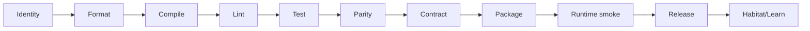
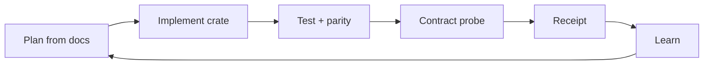

# Codebase Deployment Framework — habitat-graph

> Back to: [[CLAUDE.md]] · [[CLAUDE.local.md]] · [[habitat-graph/README]] · [[EXECUTIVE_SUMMARY]] · [[ULTRAPLATE Master Index]]
> Exemplar / gold standard: [`Louranicas/deep-diff-forge`](https://github.com/Louranicas/deep-diff-forge) `docs/DEPLOYMENT_FRAMEWORK.md`.
> **STATUS: PLANNING.** This framework is binding-as-contract; code does not exist yet. Every gate/recipe is a defined target, not a passing result.

This framework defines how **habitat-graph** is developed, validated, deployed, observed, improved,
and released. The codebase is the primary source of truth: Rust crates, CLI behaviour, tests,
fixtures, parity goldens, receipts, and docs must agree. It is modelled directly on the
deep-diff-forge gold standard and adapted for: a Python→Rust **refactor** (parity is a first-class
gate), the ULTRAPLATE **factory** wiring (orchestrator plugin, memory substrates, cognitive field),
and standalone-repo release discipline.

## Source Of Truth Order

When signals conflict, resolve in this order:

1. Rust code + tests in `crates/`, `fixtures/`, `benches/`, `fuzz/`.
2. CLI/MCP contract probes and generated receipts.
3. **Parity goldens** (Python graphify output over the `worked/` corpus) — the refactor oracle.
4. Versioned `graph.json` schema + protocol docs.
5. Deployment, operations, and release docs.
6. Exemplar notes and future plans.

Docs are binding when they define a contract code has not implemented yet. Once code exists, docs
must match observed behaviour or the gate fails.

## Bidirectional Documentation Map

This framework links to every Markdown/authority source in `habitat-graph/`. Each document links
back here via a `> Back to:` header that includes `[[DEPLOYMENT_FRAMEWORK]]` (the gold-standard
"deployment link" convention).

| Document | Deployment role |
| --- | --- |
| [README](../README.md) | Entry point, product commitment, corpus index. |
| [Executive Summary](../EXECUTIVE_SUMMARY.md) | One-page hub; thesis, the ask, at-a-glance. |
| [Crate Charter (CLAUDE.md)](../CLAUDE.md) | Invariants, gate, build discipline for the crate. |
| [Deployment Plan](../ai_docs/00_DEPLOYMENT_PLAN.md) | Spine — architecture, specs, security, diagnostics, migration, done. |
| [Graphify Exemplar Map](../ai_docs/01_GRAPHIFY_EXEMPLAR_MAP.md) | All 19 exemplar modules → Rust; every dependency → crate. |
| [Habitat Integration](../ai_docs/02_HABITAT_INTEGRATION.md) | devenv/health, memory, orchestrator pipe, arc-graph, PV2, TIERWRIGHT. |
| [Automation & Runbooks](../ai_docs/03_AUTOMATION_RUNBOOKS.md) | justfile taxonomy + runbook set design. |
| [Caching & Incremental (ADR-04)](../ai_docs/04_CACHING_INCREMENTAL_CLUSTER.md) | Cache/incremental/cluster decision; SOTA survey; the `cache` crate; frontier lane. |
| [Interface Contracts](../ai_docs/05_INTERFACE_CONTRACTS.md) | Spike — schema, salsa query graph, daemon UDS protocol, MCP/orchestrator schemas, parity-transparency invariant. |
| [Module Structure Plan](MODULE_STRUCTURE_PLAN.md) | Workspace, crate charters, module/dependency/code-flow plan. |
| [plan.toml](../plan.toml) | Machine authority — the LOOMWRIGHT warp (layers + modules + gates). |
| [ULTRAMAP](../ULTRAMAP.md) | Dependency map — bottom-up build order + parity phases. |
| [justfile](../justfile) | Front door — quality/parity/graph/deploy/habitat recipe groups. |
| [Evidence](../EVIDENCE.md) | Sealed `claim \| warrant \| evidence` record (per-phase). |
| [Deploy Runbook](../runbooks/DEPLOY_RUNBOOK.md) | Shipping a build to the live habitat. |
| [Parity Runbook](../runbooks/PARITY_RUNBOOK.md) | Proving a phase equivalent to Python graphify. |
| [Migration Runbook](../runbooks/MIGRATION_RUNBOOK.md) | P0→P6 strangler walk. |
| [Incident Runbook](../runbooks/INCIDENT_RUNBOOK.md) | Triage → mitigate → RCA → blameless postmortem. |

## Deployment Architecture

```mermaid
flowchart TB
    Code[Repository crates]
    Contracts[CLI/MCP contracts]
    Tests[Tests + fixtures]
    Parity[Parity goldens]
    Receipts[Receipts]
    Release[Release artifacts]
    Runtime[Runtime CLI/MCP/service]
    Habitat[Factory services]
    Orchestrator[Orchestrator plugin]
    Learn[Hebbian graph loop]

    Code --> Contracts
    Code --> Tests
    Code --> Parity
    Contracts --> Receipts
    Tests --> Receipts
    Parity --> Receipts
    Receipts --> Release
    Release --> Runtime
    Runtime --> Receipts
    Runtime -. health + map.scope .-> Orchestrator
    Runtime -. arc-graph + spheres .-> Habitat
    Habitat -. POVM co-activation .-> Learn
    Learn --> Code
```

## Deployment Modes

| Mode | Authority | Mutation | Required gates | Output |
| --- | --- | --- | --- | --- |
| Observe | Read-only | None | G0 identity, status | status receipt |
| Docs | Repo docs only | Markdown/specs | G1 fmt if code touched | docs receipt |
| Dev gate | Repo-local | Tests/build artifacts | G0–G4 | gate receipt |
| **Parity** | Repo-local | none (compares) | G5 parity vs goldens | parity receipt |
| Feature integration | Repo-local | crates + fixtures | full local gate G0–G6 | integration receipt |
| Service smoke | Runtime state | XDG runtime/cache only | G8 health, MCP smoke | service receipt |
| Release candidate | Dist output | release assets | G0–G9 | release receipt |
| Production release | Public remotes + crates.io | tag/assets/crates | no-mistakes gate, final ack | publication receipt |

## Gate Stack



### G0 Identity
```bash
test "$(basename "$PWD")" = "habitat-graph"
git status --short --branch && git remote -v
CARGO_TARGET_DIR=target cargo metadata --no-deps >/dev/null
```
Accept: repo basename `habitat-graph`; standalone remotes configured (never the superproject); build target repo-local.

### G1 Format · `cargo fmt --all --check`
Accept: Rust formatting passes; Markdown avoids accidental non-ASCII.

### G2 Compile · `CARGO_TARGET_DIR=target cargo check --workspace`
Accept: workspace compiles; CLI works without the habitat feature; `--features habitat` also compiles.

### G3 Lint · `cargo clippy --workspace --all-targets -- -D warnings` then `-W clippy::pedantic`
Accept: warnings fail; `forbid(unsafe)` workspace-wide (except the isolated tree-sitter FFI wrappers); no unexplained suppressions.

### G4 Test · `CARGO_TARGET_DIR=target cargo test --workspace --locked`
Accept: every production module ≥50 meaningful tests before release-eligible; integration tests for every public command/API/MCP/filesystem boundary; follows [Testing Gold Standard](MODULE_STRUCTURE_PLAN.md#testing-gold-standard); **test fitting is banned**.

### G5 Parity (the refactor gate) · `just parity`
Fixture groups: `tests/goldens/{example,httpx,karpathy-repos,mixed-corpus}`.
Accept: 0 **REGRESSION** vs Python golden; SEMANTIC-EQUIVALENT classes documented; goldens hash-verified unchanged. → [Parity Runbook](../runbooks/PARITY_RUNBOOK.md).

### G6 Contract · CLI + MCP probes
```bash
cargo run -p habitat-graph-cli -- --self-test
cargo run -p habitat-graph-cli -- doctor
cargo run -p habitat-graph-cli -- extract tests/fixtures/example --no-llm --json
cargo run -p habitat-graph-cli -- query "..." --json
cargo run -p habitat-graph-cli -- path A B --json
# MCP: rmcp stdio handshake + tools/list returns query|path|subgraph
```
Accept: machine commands need no TTY; JSON is a complete document; JSONL one event/line; stdout=output, stderr=diagnostics; exit codes match documented meanings.

### G7 Package · `cargo package --workspace` + `cargo build -p habitat-graph-cli --release --locked`
Accept: package metadata complete (`[workspace.package]` inheritance, per-crate description/keywords/categories); binary reports version.

### G8 Runtime smoke
```bash
target/release/habitat-graph --help|--version|--self-test
target/release/habitat-graph serve --features habitat &   # MCP/HTTP
cc-health habitat-graph                                    # path-map aware
```
Accept: CLI runs without the service; `/health` returns version + node/edge counts + backend mode; service binds only user-private UDS/port.

### G9 Release
Order: clean main commit → release receipt → tag `vX.Y.Z` → push GitHub → push GitLab (when remote exists) → upload assets → publish crates only after binary smoke (dep order `core … cli`; topo-order matters — DDF caught a `tui`-before-`cluster` bug).

### G10 Habitat / Learning
Inputs: deployment receipts, parity drift, arc-coherence delta, POVM co-activation, PV2 field coverage. Output: planner defaults, backend routing, suggested-query ranking, doc corrections. **No learned behaviour may mutate extracted graph truth.**

## Agentic Rust Coder V4 Gate

Implementation standard for Rust changes (habitat `forge-rust-coder-v4`). Every substantive claim is
warranted `[VBR]` (verified by read), `[VBE]` (verified by execution), `[IFP]` (inferred from
pattern), or `[CONJ]` (conjecture). The required loop:
```text
read relevant code -> make smallest change -> just gate -> read output -> decide
```
Rules: no production `unwrap`/`expect`; no unexplained clippy suppressions; no reflexive
`clone`/`Arc<Mutex>`/`'static` to appease the compiler; no perf claim without a bench; no completion
claim without command output or file:line evidence. The executable gate is `just gate` (G1–G6) /
`just gate-feature`.

## Receipt Schema

Every deployment run writes `reports/deployments/YYYYMMDDTHHMMSSZ/` with per-gate `*.txt` plus:
```json
{
  "schema": "habitat-graph.deployment-receipt.v0",
  "repo": "habitat-graph",
  "commit": "<sha>",
  "mode": "parity|dev-gate|release|…",
  "gates": {"identity":"pass","fmt":"pass","check":"pass","test":"pass","parity":"pass","contract":"pass"},
  "parity": {"fixtures": 4, "regressions": 0, "semantic_equivalent": 3},
  "habitat": {"observed": true, "required_for_pass": false}
}
```
`reports/` is gitignored.

## Habitat And Factory Service Collaboration

habitat-graph collaborates through observable contracts (CLI status, JSON health, UDS/MCP, receipts)
and **adopts the factory pattern, not a hard runtime dependency** — the CLI owns graph truth.

### Service Row (future registry entry)
| Field | Value |
| --- | --- |
| id | `habitat_graph` |
| name | `habitat-graph` |
| transport | HTTP `/health` + MCP (stdio/SSE) |
| port | **TBD via `port-claim`** (never hardcoded — S1005032) |
| health | `GET /health` → version, nodes, edges, last_build_ts, backend_mode |
| required modes | `gate_only`, `deploy_dev`, `production` when service enabled |
| protected | false |

### Factory Mode Mapping
| Factory mode | habitat-graph action |
| --- | --- |
| `research` | Read docs, run contract probes, write analysis receipt. |
| `gate_only` | Run G0–G6 local gates + parity; write receipt. |
| `deploy_dev` | Build release, MCP/health smoke, register `mcp__habitat-graph__*`, dev receipt. |
| `production` | Final human ack, no-mistakes gate, release receipt; crates.io is irreversible/yank-only. |

### Habitat Safety Rules
- Factory services may observe and gate; the Rust CLI owns engine behaviour.
- Habitat may not rewrite extracted graph truth.
- Habitat may not publish releases without release receipts.
- No step auto-arms `factory.authorize.habitat-graph` (read-only; Luke @ 0.A sets it).
- PV2 sphere registration honours the sphere-id naming convention (the WFE/LCM severance trap).

## No-Mistakes Deployment Loop
```text
scope -> implement -> fmt -> check -> lint -> test -> parity -> contract
  -> review diff -> receipt -> push -> CI -> release gate
```
Findings lead, summaries follow. Tests scale with blast radius. Dirty unrelated files are ignored,
not reverted. A green deployment requires receipts, not local confidence. Network publication is
separate from local validation.

## Synergy Loops

Plus the **Habitat loop** (arc-graph → arc-coherence gauge → bridge-contract → archive) and the
**Hebbian loop** (query → POVM co-activation → suggested-query ranking → graph).

## Deployment File Ownership
| Path | Owner | Role |
| --- | --- | --- |
| `crates/` | Rust implementation | source of behaviour |
| `tests/goldens/` | parity owners | frozen Python-graphify oracle |
| `fixtures/` | test owners | small reproducible evidence |
| `benches/` | perf owners | latency/memory evidence (500K-LOC extract) |
| `fuzz/` | parser owners | tree-sitter resilience evidence |
| `docs/` + `ai_docs/` | architecture owners | source-of-truth contracts until code lands |
| `runbooks/` | ops owners | operational procedures |
| `reports/` | deployment runner | receipts (gitignored) |
| `$XDG_CACHE_HOME/habitat-graph/` | cache | content-addressed (blake3) extract cache |
| `graphify-out/` | runtime | `graph.json`, `graph.html`, `GRAPH_REPORT.md` |

## Environment Variables
| Variable | Purpose |
| --- | --- |
| `CARGO_TARGET_DIR=target` | repo-local build output |
| `HABITAT_GRAPH_BACKEND` | `ast` (default on code) \| `ollama` \| `tierwright` |
| `HABITAT_GRAPH_OUT` | output dir override (else `graphify-out/`) |
| `HABITAT_GRAPH_CACHE_DIR` | extract cache override |
| `NO_COLOR` | disable ANSI for CI |
No env var may be required for correctness when a CLI flag can express the same requirement.

## Blocking Rules
Block when: Rust compile fails · contract probes fail · **any parity REGRESSION** · graph truth
cannot be produced for supported input · release receipt cannot be written · production lacks final
ack · publication credentials missing. Warn-not-block (docs-only): GitLab mirror unavailable ·
optional habitat services degraded · Zellij layout differs.

## Rollback Framework
| Surface | Rollback |
| --- | --- |
| Docs | revert/amend doc commit |
| CLI binary | restore previous `.bak` artifact + `devenv restart` |
| Crates | patch release or yank only if dangerous |
| Service | stop, remove owned socket, restore previous binary |
| Cache | ignore incompatible versioned entries |
| Release | mark superseded + publish corrective receipt |
Rollback receipts record prior/target version, reason, commands, verification, remaining risks.

## Deployment Maturity Levels

Mirrors DDF's L0→L9 ladder, mapped onto habitat-graph's pipeline + this refactor's phases
(`MIGRATION_RUNBOOK`). Numbered **D0–D8** to avoid clashing with the code-layer L0–L8.

| Level | Name | Criteria | Phase |
| --- | --- | --- | --- |
| D0 | Bootstrap | docs, vocabulary, CLI smoke | — |
| D1 | Schema | `graph.json` (de)serialize + guard; golden roundtrip | P0 |
| D2 | Extract | tree-sitter AST extractors; node/edge parity | P1 |
| D3 | Graph | petgraph build + Leiden + analysis; community parity | P2 |
| D4 | Output | report + all exporters match goldens | P3 |
| D5 | Interface + **daemon** | CLI + MCP (`rmcp`) + watch + hooks + **warm-DB daemon** (salsa): sub-second incremental queries · **live subscriptions** · **persistence** · shared warm graph; **Python graphify retireable** | P4 |
| D6 | Habitat | orchestrator pipe · arc-graph · POVM/Obsidian · PV2 · TIERWRIGHT | P5 |
| D7 | Release | tags, assets, crates.io, CI, no-mistakes gate | — |
| D8 | Learning | Hebbian-reinforced graph; SLO-backed defaults | P6 |

**Current: pre-D0** — planning corpus only; no crate exists.

## Framework Maintenance
Update this document when: a new crate is added · a new command/MCP contract is introduced · the
parity oracle version changes · CI gates change · habitat integration changes · release channels
change · a new Markdown document is added. Every new document must be added to the Bidirectional
Documentation Map and carry a `> Back to:` link including `[[DEPLOYMENT_FRAMEWORK]]`.

---
*Codebase Deployment Framework authored S1008796 · Claude @ cortex · gold standard = Louranicas/deep-diff-forge. Planning phase: binding-as-contract, not yet implemented.*
