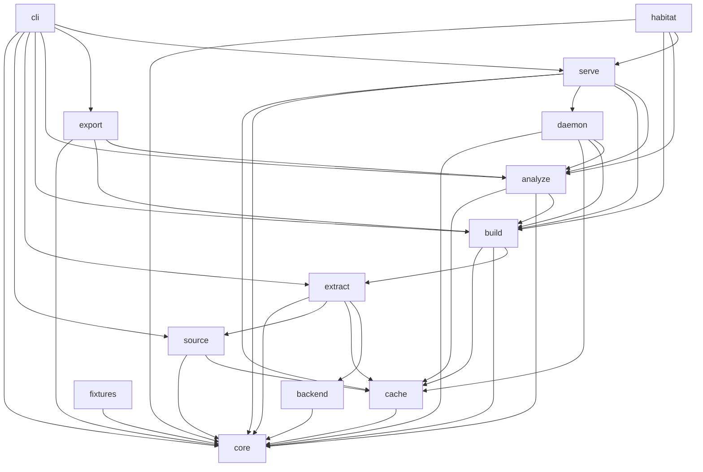

# Module Structure Plan — habitat-graph

> Back to: [[CLAUDE.md]] · [[habitat-graph/README]] · [[DEPLOYMENT_FRAMEWORK]] · spine: [[00_DEPLOYMENT_PLAN]] · machine pair: [[plan.toml]] · [[ULTRAMAP]]
> Exemplar / gold standard: [`Louranicas/deep-diff-forge`](https://github.com/Louranicas/deep-diff-forge) `docs/MODULE_STRUCTURE_PLAN.md`.
> **STATUS: PLANNING.** Crate charters are contracts for the build, not implemented code.

habitat-graph is a Rust **workspace of narrow crates** with small modules and one-way dependency
flow — the deep-diff-forge gold standard applied to the graphify exemplar. It is NOT one large
engine crate. Each crate can be tested, benchmarked, fuzzed, and (for the OSS set) released with a
stable contract.

The design draws from two exemplars:
- **graphify** (the port source): the pipeline `detect → extract → build → cluster → analyze → report → export` and the `{nodes,edges,confidence}` schema. Keep its algorithmic clarity.
- **deep-diff-forge** (the gold standard): core-as-vocabulary, narrow crates, acyclic inward dependency, receipts-as-output, fixtures crate, ≥50 meaningful tests/module, anti-test-fitting.

## Design Rules

1. **Core is vocabulary, not behaviour.** `habitat-graph-core` owns IDs, the Node/Edge/Graph/Community model, `Confidence`, receipts, errors. It does not walk the filesystem, run tree-sitter, call an LLM, or open a socket.
2. **AST/extraction truth is upstream of every other feature.** Extraction must be usable without analysis, export, MCP, service, or habitat wiring.
3. **Each crate owns one reason to change.** Grammar upgrades, exporter changes, MCP protocol, and factory wiring do not land in the same crate.
4. **Dependency flow is inward and acyclic.** Feature crates may depend on `core`; `core` depends on no feature crate. `analyze` may depend on `build`; `extract` must not depend on `export`.
5. **Public APIs are explicit.** Each crate exposes a small `lib.rs` facade; internals stay `pub(crate)` unless genuinely needed.
6. **Rust first, CLI first, service optional.** All behaviour works in one-shot CLI mode. The MCP/HTTP service accelerates shared use but does not own correctness.
7. **Receipts + parity are first-class outputs.** Extraction, parity, and release operations produce structured receipts with versions, inputs, and results.
8. **Habitat coupling is additive.** Only `habitat-graph-habitat` touches POVM/PV2/Obsidian/orchestrator; the OSS core compiles and runs without it.

## Workspace Layout

```text
habitat-graph/
  Cargo.toml                      # [workspace], [workspace.package], [workspace.dependencies]
  crates/
    habitat-graph-core/           # L0+L1  vocabulary + guard
    habitat-graph-cache/          # L1.5   content-addressed store (blake3) + memoized query engine (ADR-04)
    habitat-graph-source/         # L2     detect/ingest/manifest
    habitat-graph-extract/        # L3     tree-sitter extractors + registry
    habitat-graph-backend/        # L3     LLM backend trait + impls (semantic path)
    habitat-graph-build/          # L4     petgraph assembly
    habitat-graph-analyze/        # L5     Leiden + centrality + patterns + questions
    habitat-graph-export/         # L6     report + json/html/svg/graphml/cypher/obsidian/wiki
    habitat-graph-daemon/         # L7     warm-DB host (salsa DB + UDS, morphd-shaped) — ADR-04 §8.2
    habitat-graph-serve/          # L7     transport: rmcp MCP + axum /health + subscriptions (daemon clients)
    habitat-graph-cli/            # L7     clap binary (the product interface)
    habitat-graph-habitat/        # L8     factory wiring (feature = "habitat")
    habitat-graph-fixtures/       # parity goldens + harness (dev-only)
  fixtures/                       # small reproducible inputs
  tests/goldens/                  # frozen Python-graphify oracle (example, httpx, …)
  benches/                        # extract_500kloc.rs, leiden_cluster.rs, export_html.rs
  fuzz/fuzz_targets/              # treesitter_extract.rs, graphjson_parse.rs
  docs/  ai_docs/  runbooks/
```

## Dependency Graph



Forbidden dependencies:
- `core` must not depend on any other habitat-graph crate.
- `cache` must depend only on `core`; it must not depend on any feature crate (ADR-04).
- the cache must be **transparent to parity**: a hit is byte-identical to a recompute (asserted at G5).
- `extract` must not depend on `build`, `analyze`, `export`, `serve`, or `tui`.
- `analyze` must not depend on `export`; export consumes analysis.
- `habitat` must not be required by any OSS crate or by CLI one-shot commands.
- nothing depends on `habitat` except the optional service binary path.

## Crate Charters

### `habitat-graph-core`  (L0 + L1)
Stable model + security boundary. Compiles fast, minimal deps.
```text
src/
  lib.rs
  ids.rs           # NodeId, EdgeId, CommunityId, SpanId interning
  span.rs          # source_file + byte/line ranges
  schema.rs        # Node, Edge, Graph, Community, Manifest (serde; graph.json R2 byte-compat)
  confidence.rs    # Confidence{Extracted,Inferred,Ambiguous} — the trust signal
  config.rs        # load/merge/validate
  receipts.rs      # shared receipt headers + status
  errors.rs        # thiserror taxonomy; no panics in lib
  guard/
    mod.rs
    url.rs         # validate_url (allow/size/timeout)
    path.rs        # confine to output dir (anti-traversal)
    sanitize.rs    # label: 256-char cap, strip control chars, display_safe (Trojan-Source/bidi defence — DDF lesson)
    secrets.rs     # canonical public-output redaction; raw graph values stay internal
```
Responsibilities: IDs · ranges · the graph model · confidence · config · receipts · the security
boundary (every external input funnels through `guard`). Public-API rule: `lib.rs` re-exports stable
types; no filesystem/network/terminal/parser ops. **Gold-standard tests:** schema roundtrip, every
guard rule incl. Trojan-Source/bidi escapes at the render boundary (the residual DDF's first seal missed).

### `habitat-graph-cache`  (L1.5) — the incremental substrate (ADR-04)
The cross-cutting cache, as ONE crate (never per-crate). Depends only on `core`.
```text
src/
  lib.rs
  cas.rs           # content-addressed store: blake3(stage ‖ input_hash ‖ config_hash) -> output
  memo.rs          # demand-driven memoized query layer (salsa-compatible API shape)
  partition.rs     # cached/uncached file partition (moved here from source — single cache truth)
  evict.rs         # retention policy trait (LRU default; POVM-weighted policy injected by L8)
  key.rs           # stable key derivation; remote-cache-ready scheme (Bazel-style), build never
```
Responsibilities: deterministic memoization keyed on content hashes; per-file→per-stage granularity;
transparent to parity (hit == recompute). Rule: holds state but no domain logic; stages stay pure
functions whose inputs are hashable. Tests: hit/miss correctness, invalidation on input change,
**parity-transparency** (cached run byte-identical to cold run), eviction policy.

### `habitat-graph-source`  (L2)
```text
src/
  lib.rs
  detect.rs        # walkdir + extension dispatch; honor .gitignore (ignore crate)
  ingest.rs        # remote fetch, size/timeout caps (reqwest)
  manifest.rs      # processed-input manifest (paths, hashes, ts) — partition now lives in `cache`
```
Flow: `dir -> detect -> [files] -> cache partition -> manifest`. Tests: extension table, ignore
honoring, cap enforcement, hash invalidation.

### `habitat-graph-extract`  (L3)
Canonical extraction — the bulk of the port's value, fully local.
```text
src/
  lib.rs
  registry.rs      # Extractor trait + language dispatch (rayon parallel map)
  ast/
    mod.rs  rust.rs  python.rs  js_ts.rs  go.rs  jvm.rs  c_cpp.rs  misc.rs
  ffi.rs           # the ONLY unsafe surface: tree-sitter C-binding wrappers, isolated
  semantic.rs      # LLM/semantic extraction for docs/PDF/image (opt-in; calls backend)
```
Flow: `file bytes -> grammar parse -> walk AST -> {nodes,edges,confidence}`. Tests: per-grammar node/edge
extraction vs goldens; confidence assignment; FFI wrapper soundness; parallel determinism.

### `habitat-graph-backend`  (L3)
```text
src/
  lib.rs
  trait.rs         # Backend: extract_semantic(text) -> {nodes,edges}
  ollama.rs        # local-first
  openai_compat.rs # generic HTTP
  noop.rs          # AST-only default (no network)
```
Rule: code extraction defaults to `noop` (R3 local-first). The `tierwright` impl lives in L8 `habitat`.

### `habitat-graph-build`  (L4)
```text
src/  lib.rs  assemble.rs  dedup.rs  merge.rs  merge_driver.rs  merge_identity.rs
```
Flow: `Vec<Extraction> -> petgraph::Graph (stable NodeId interning) -> dedup -> merge (confidence reconcile)`.
`merge_identity` separates clean label identity from lossy redacted public projections; `merge` and the
3-way `merge_driver` keep published node IDs + branch provenance for lossy nodes/relations.
Tests: dedup correctness, merge associativity, deterministic node/edge ordering (R4, merge-driver requirement).

### `habitat-graph-analyze`  (L5)
```text
src/  lib.rs  cluster.rs (Leiden via network_partitions)  centrality.rs  patterns.rs  questions.rs
```
Flow: `Graph -> communities + centrality -> patterns/anomalies -> open-questions`. Tests: Leiden
determinism (seeded), centrality vs petgraph reference, pattern rules, question surfacing.

### `habitat-graph-export`  (L6)
```text
src/
  lib.rs  report.rs (minijinja)  benchmark.rs (tiktoken-rs)
  export/
    mod.rs  json.rs  html.rs  svg.rs  graphml.rs  cypher.rs  obsidian.rs  wiki.rs
```
Flow: `Graph + analysis -> deterministic public projection -> destination escaping -> artifacts`.
The projection redacts screened strings without changing node IDs, edge endpoints, counts, or
communities. Tests: each exporter vs golden; cross-format redaction parity; html self-contained;
json schema-compat (R2); obsidian wikilink correctness; benchmark token math.

### `habitat-graph-daemon`  (L7) — the warm-DB host (ADR-04 §8.2, the "cluster")
The long-running process holding the salsa DB + warm graph; morphd-shaped UDS. The capacity multiplier.
```text
src/
  lib.rs
  server.rs      # UDS accept loop ($XDG_RUNTIME_DIR/habitat-graph/*.sock, 0o600)
  session.rs     # multi-client sessions over one warm DB
  subscribe.rs   # live query subscriptions — push deltas on salsa red-green invalidation
  persist.rs     # durable incrementality: DB survives restart ($XDG_STATE_HOME/habitat-graph/)
  health.rs      # protocol versions, pid, session count, cache status
```
Responsibilities: own the salsa DB; serve concurrent clients; push subscription deltas; persist +
restore. Rule: the CLI one-shot path must NOT require the daemon (Design Rule 6). Tests: UDS lifecycle,
session isolation, subscription delta correctness, persist→restart→warm roundtrip, socket security (0o600).

### `habitat-graph-serve`  (L7) — transport over the daemon
```text
src/  lib.rs  mcp.rs (rmcp #[tool] query/path/subgraph/subscribe)  http.rs (axum /health)  watch.rs (notify)  hooks.rs (git2 + merge driver)
```
Clients of the daemon's warm DB (or an ephemeral DB in one-shot). Tests: rmcp tools/list + each tool incl. `subscribe`; `/health` shape; watch debounce; hook install; merge-driver conflict-free `graph.json`.

### `habitat-graph-cli`  (L7, the product binary)
```text
src/  main.rs  cli.rs (clap)  commands/{extract,update,add,query,serve,mcp,install,install_mcp,hook,watch,merge_driver,meta}.rs
      commands/private_state.rs (owner-only raw update/add state)  commands/atomic_file.rs (durable atomic writes)
```
Contract: machine commands need no TTY; stdout=output, stderr=diagnostics; documented exit codes. Tests: per-subcommand contract (stdout/stderr/exit), `--self-test`, `doctor`.

### `habitat-graph-habitat`  (L8, `feature = "habitat"`)
```text
src/
  lib.rs
  bridge.rs            # health/bridge; cc-health path-map
  memory.rs            # POVM pathway + injection.db causal_chain (no-risk write regime)
  obsidian_protocol.rs # Back-to protocol + MASTER_INDEX + hmem rebuild
  pv2_spheres.rs       # Leiden community -> PV2 sphere (naming-trap guarded)
  orchestrator_pipe.rs # cc-pipe verb map.scope; ACK/NACK schema
  tierwright.rs        # Backend impl routing via TIERWRIGHT :8201
  arc_graph.rs         # producer->consumer arc extractor + severed-ear diff
```
Rule: additive; never load-bearing on the core. Tests: each wire mocked at the boundary; arc-graph reproduces the known arc set + flags a known severed ear; schema-validated NACK on bad pipe input.

### `habitat-graph-fixtures`  (dev-only)
Owns `tests/goldens/` loading + the parity harness (diff + EXACT/SEMANTIC/REGRESSION classifier). Excluded from the publishable workspace (like DDF's `fuzz/`).

## Code-Flow (end to end)
```text
dir
  -> source::detect -> [files]
  -> extract::registry (rayon) -> Vec<Extraction>{nodes,edges,confidence}
  -> build::assemble -> petgraph Graph
  -> analyze::cluster/centrality/patterns -> communities + signals
  -> export::{report,json,html,…} -> graphify-out/
  -> serve::mcp (query/path/subgraph)  |  habitat::{arc_graph,pv2,memory,orchestrator_pipe}
```

## Testing Gold Standard
(Adopted from DDF `TESTING_GOLD_STANDARD.md`.)
- **≥50 meaningful tests per production module** before it is release-eligible.
- **Anti-test-fitting:** tests assert real behaviour + edge cases, never reshaped to pass a known output. Judged by `forge-tester` (outside the build loop).
- **Integration tests at every boundary:** CLI command, MCP tool, filesystem, cache, the `graph.json` wire.
- **Parity tests** (in `fixtures`) are separate from unit tests and gate every phase (G5).
- **Determinism tests:** sorted node/edge ordering (R4); seeded Leiden.
- Floor: ~35 substantive modules × 50 ≈ **1750 tests** (cf. DDF 1934, factory-map 1934, WFE 2163).

## Maintenance
Update this plan when a crate is added/split, a module's responsibility changes, a dependency edge
is added (re-check the acyclic rule), or the parity oracle version changes. Keep `plan.toml` +
`ULTRAMAP.md` in sync — they are the machine pair of this prose.

---
*Module Structure Plan authored S1008796 · Claude @ cortex · gold standard = Louranicas/deep-diff-forge.*
